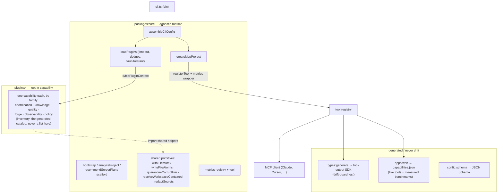

# Architecture — `@delendai/core`

How the monorepo fits together, what the boundaries are, and which invariants hold
across them. For the working rules see [`AGENTS.md`](../../AGENTS.md); for the live
roadmap see [`docs/delendai/proposals/done/audits/`](./proposals/done/audits).

## The one idea

A **small, project-agnostic core** that knows how to assemble and serve an MCP
server, plus **opt-in plugins** that carry all the domain capability. The core
never imports a plugin and never encodes a host's vocabulary; plugins receive
everything they need — resolved paths, options, namespace — through a single
context object. That separation is what lets the same plugin behave identically
under any host or model.



## Layers

| Layer            | Path                         | Responsibility                                                                                             | Depends on                              |
| ---------------- | ---------------------------- | ---------------------------------------------------------------------------------------------------------- | --------------------------------------- |
| **Core runtime** | `packages/core`              | Tool registry, plugin loader, bootstrap/scaffold, metrics, shared FS primitives, CLI. **No domain logic.** | only `@modelcontextprotocol/sdk`, `zod` |
| **Plugins**      | `plugins/*`                  | One capability each, namespaced. Receive `IMcpPluginContext`.                                              | `@delendai/core/public`               |
| **Site**         | `apps/web`                   | Astro product/docs site, generated from the **live** registry.                                             | core + all plugins (build-time only)    |
| **Examples**     | `docs/delendai/examples/*` | Minimal host, custom plugin, swarm.                                                                        | core (+ plugins)                        |
| **Scripts**      | `tools/scripts/*`            | build · derive-version · release · type/schema generation. Pure planning split from side-effecting shells. | core                                    |

The dependency arrow only ever points **plugin → core**, never the reverse.

The plugin inventory is deliberately not written down here. It changes every
week, and a hand-maintained list is a document that quietly starts lying — this
one named sixteen plugins while the tree held fifty-six. The live inventory is
the generated catalog: `bun run catalog:generate`, rendered into
[`host-hints/agent-instructions.generated.md`](host-hints/agent-instructions.generated.md),
and served at runtime by `delendai_overview` / `delendai_agent_catalog`.

## Core/plugin boundary

The workflow boundary introduced by `r00043` is now explicit: the reusable seam lives in
`packages/core/src/lib/contracts`, plugin-specific behavior lives in plugin adapters, and
host-facing orchestration lives in composition/bootstrap surfaces.

```text
core contracts → plugin adapters → host composition
```

The practical reading is strict:

- Core contracts define neutral DTOs, registries and runtime seams.
- Plugin adapters own domain vocabulary such as `proposals` stores, tool ids and compatibility shims.
- Host composition may still mention a plugin by name when it is describing what a loaded host can do, but that coupling must be explicit, time-boxed and reviewable.

`tools/scripts/inspect/core-proposals-boundary.script.ts` remains the inventory/audit view. The permanent regression guard is `tools/scripts/lint/core-proposals-boundary.script.ts`, which scans `packages/core/src` and rejects any new `proposals` imports, paths or workflow literals unless they are covered by an explicit exception with `until` + reason.

## Core boundary

`packages/core` is the runtime substrate of DelendAI, not the place where every first-party concern lives forever.

Core means the invariants that any host or plugin needs at runtime:

| Area                            | In core                                                          | Why it belongs in core                                       |
| ------------------------------- | ---------------------------------------------------------------- | ------------------------------------------------------------ |
| Contracts                       | `contracts/interfaces`, `contracts/constants`                    | Shared DTOs, tool contracts and stable runtime vocabulary.   |
| Plugin lifecycle                | `definePlugin`, `IMcpPluginContext`, loader/runtime hooks        | Every plugin crosses this seam.                              |
| Server assembly                 | `assembleCliConfig`, `createMcpProject`, tool registration order | The runtime that turns config + plugins into one MCP server. |
| Workspace security              | contained-path resolution, atomic writes, mutexes, redaction     | Safety invariants must stay centralized and host-agnostic.   |
| Response helpers                | checkpoint advisories, output helpers, validation matrix seams   | Shared runtime behavior seen by every tool.                  |
| Metrics and observability seams | metrics registry, tool wrappers, status collectors               | Cross-cutting runtime instrumentation.                       |

Non-core concerns may live in this package today for delivery convenience, but they are conceptually outside the runtime boundary and are candidates for later extraction only when measurements justify it:

| Area                     | Not core                                                                | Why it stays outside the runtime definition                  |
| ------------------------ | ----------------------------------------------------------------------- | ------------------------------------------------------------ |
| Authoring                | scaffolding, plugin creation, blueprint rendering, host file generation | Developer tooling, not runtime invariants.                   |
| Setup                    | install helpers, cross-project setup guides, IDE config writers         | Bootstrapping and adoption flows, not request-time behavior. |
| Analyzer                 | project analysis, server recommendations, catalogs                      | Planning/orientation surfaces rather than runtime substrate. |
| Hosts                    | host-specific adapters, prompts, generated host hints                   | Integration packaging around the runtime.                    |
| Install/catalog surfaces | registries, first-party plugin catalog, publish wiring                  | Distribution and product packaging concerns.                 |

The practical rule is: if a plugin or host must import it to behave correctly at runtime under any workspace, it can belong to core; if it exists to author, install, analyze, scaffold or package that runtime, it is outside the core boundary even when it still ships from this package today.

## Measured cold-start boundary

CHECK-005 requires data before splitting `@delendai/core` into more packages. The current repo now measures three entrypoints with [tools/scripts/perf/cold-start.script.ts](tools/scripts/perf/cold-start.script.ts):

| Entrypoint        | Purpose                     | Cold start | Local modules | RSS delta | Bundle size |
| ----------------- | --------------------------- | ---------: | ------------: | --------: | ----------: |
| `plugin-contract` | Minimal plugin SDK contract |    1.07 ms |            15 |  1.50 MiB |       118 B |
| `public`          | Current public barrel       |  120.92 ms |           238 | 57.37 MiB |   511.5 KiB |
| `cli`             | Published CLI entry         |  127.54 ms |           179 | 56.31 MiB |   399.4 KiB |

Measured on 2026-08-24 from a clean Bun process per import (`process.memoryUsage()` + `performance.now()` + bundled output size).

The conclusion today is straightforward:

- CORE-004 is already true for the plugin contract. `packages/core/src/lib/plugins/plugin-contract.ts` imports only contract interfaces; the one remaining commit-author type dependency was moved under `contracts/interfaces`, so the contract remains dependency-clean and type-only.
- The minimal SDK seam is already tiny. Physically extracting `@delendai/plugin-sdk` today would mostly relocate a 15-module, 118-byte bundle surface rather than remove meaningful runtime cost.
- The actual cold-start cost sits in the broad public barrel and CLI assembly surfaces, not in the plugin contract itself.

So CHECK-005 does not justify a package split today. A future physical SDK package remains valid only if a later measurement shows a material improvement for real host/plugin import paths, or if we intentionally want a narrower published surface for third-party plugin authors independent of startup wins.

## Key contracts (`packages/core/src/lib/contracts`)

- **`IMcpPlugin` / `definePlugin`** — a plugin is `{ name, optionsSchema?, register(ctx) }`
  returning `{ tools, prompts, resources, knowledge }`.
- **`IMcpPluginContext`** — `workspace`, `corePaths`, `pluginCacheDir`, `pluginDocsDir`,
  `namespacePrefix`, `options`, `args`. Everything a plugin needs, pre-resolved.
- **`IToolRegistration`** — `{ id, summary, tags, register(server) }`; each tool declares
  an `inputSchema` and an `outputSchema` (Zod). An e2e guard fails the build if any tool
  omits its `outputSchema`.
- **`IWorkspacePathProvider`**, **`IStatusCollector`**, **`IValidationMatrix`** — the host
  surfaces the core consumes.

## How a request flows

1. `cli.ts` parses args (`parseCliArgs`) and calls `assembleCliConfig`.
2. `loadPlugins` resolves each `--plugins=` specifier (short name, scoped package, path),
   dedupes, and imports under a timeout; a broken plugin is skipped, never fatal.
3. `createMcpProject` registers every tool deterministically, wrapping each with the
   metrics collector (latency, bytes, errors) before exposing it.
4. The server serves over stdio. `overview` gives a one-call, low-token map; `auto_work`
   gives a tight next-action plan plus a delegation policy for non-trivial slices.

## Cross-cutting invariants

- **Agnostic core** — no domain code, no `process.cwd()` in engines (paths are injected).
- **Async I/O in hot paths** — `fs/promises`; `*Sync` only in documented boot one-shots.
- **Durable writes** — `withFileMutex` (ownership token + heartbeat + steal-on-stale) +
  `writeFileAtomic`; corrupt ≠ empty (`quarantineCorruptFile`).
- **Contained paths** — workspace-scoped path inputs go through `resolveWorkspaceContained`.
- **No secret leakage** — durable stores run text through `redactSecrets`.
- **Measured token budget** — `overview`/`auto_work` stay under e2e-guarded ceilings.
- **No drift** — the typed SDK, the site's `capabilities.json` and the config schema are
  all generated from the live registry; drift-guards fail the build.
- **Single orchestrator contract** — `delendai` is the only source of truth for the
  orchestrator workflow. The Copilot adapter (`.github/agents/delendai.agent.md`)
  is a thin redirector that loads `delendai_overview`'s `recommendedNextAction`
  instead of restating the workflow in prose; `bun run lint:agents` warns on drift
  (f00031).
- **Agent filenames are namespaced, slot ids are not** — bounded subagents live at
  `.github/agents/delendai-<slot>.agent.md` (e.g. `delendai-proposal-guardian.agent.md`)
  so the VS Code picker stays clean when the workspace hosts more than one MCP server.
  The frontmatter `name:` field stays unprefixed (`proposal_guardian`) because that is
  the key the swarm uses for `agent_lock`, `task_queue`, and the agent-registry store.
  `SUBAGENT_FILE_BY_SLOT` in `tools/scripts/lint/agent-redirector-contract.script.ts`
  is the canonical map and `bun run lint:agents` rejects any drift.

## Build, test, release

- **Build:** `bun run build` (`tools/scripts/compile/build.script.ts`) → per-package `dist/` (`bun build` ESM + `tsc
  --emitDeclarationOnly`); `exports`/`bin` point at `.js`/`.d.ts` so `npx`/`node` work.
- **Test:** Vitest — unit, concurrent-chaos (multi-process locks), e2e over a real
  in-memory MCP server (outputSchema + token budget), drift-guards.
- **Release:** push to `main` → Conventional Commits derive the version
  (`tools/scripts/release/derive-version.script.ts`) → tag + publish, lockstep, no commit-back loop.
- **CI:** lint · typecheck+coverage · pack-smoke (`npm pack --dry-run` + a functional
  stdio smoke of the compiled CLI) · Pages (site in `--strict`).

See [`README-DELENDAI.md`](README-DELENDAI.md) (host authors),
[`PLUGINS-DELENDAI.md`](PLUGINS-DELENDAI.md) (plugin authors) and
[`TOKEN-BUDGETS.md`](TOKEN-BUDGETS.md) (the measured low-token proof).
