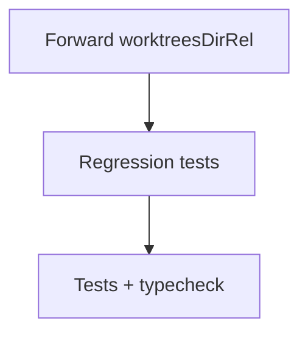

# x00428 — `delegate` worktree engine forward canonical `worktreesDirRel` (single authority for swarm path)

## Goal

Que `proposals_delegate` coloque los worktrees por agente bajo la **misma ruta canónica** que ya leen `agent_worktree`, `branch_status` y `swarm_hygiene` (`<cacheDir>/.worktrees/<agent>`), en lugar de caer silenciosamente a `<workspaceRoot>/.worktrees/<agent>`.

Hoy las dos superficies del enjambre discrepan sobre dónde viven los worktrees, y `swarm_hygiene.outOfCache` marca cada worktree delegado como desplazado — exactamente la clase de bug que el segundo GPT identificó al contrastar la rama develop con la conversación sobre el State Engine.

## why

Cuando el host activa la puerta `agentWorktree`, `proposals_delegate` invoca `runAgentWorktreeEngine` con solo `{run, workspaceRoot}` y omite `worktreesDirRel`. El motor cae entonces al default interno `<workspaceRoot>/.worktrees` — **no** a la ruta cache-rooted que usa la herramienta explícita `agent_worktree`. Las dos rutas de creación de worktrees divergen en silencio; los lectores posteriores (`branch_status`, `swarm_hygiene`) confían en `layout.worktreesDir` y marcan cada worktree delegado como `outOfCache: true`.

Esto es el mismo patrón que ya arregló f00073 en `branch_status` (el bug del doble prefijo `.cache/delendai/${layout.worktreesDir}`). Pero el origen del bug — el delegate que no propaga `worktreesDirRel` — nunca se corrigió.

La consecuencia operativa es seria: una vez que el motor decide crear el worktree, **no hay forma posterior** de que el swarm reconozca dónde vive, porque el path físico diverge del path que la registry indexa. Cualquier `WorktreeRegistry` o `coordination.sqlite` que se construya encima de esto heredaría la divergencia.

El arreglo correcto es único y trivial: que `delegate` propague `layout.worktreesDir`, igual que `agent_worktree` ya hace en `plugins/proposals/src/index.ts:571`.

## why this design

El path de los worktrees ya tiene UNA autoridad canónica: `layout.worktreesDir`, construida por `buildSwarmPaths(cacheDir, docsDir)` en `plugins/proposals/src/lib/contracts/constants/default-path-layout.constant.ts`. Cualquier consumidor que no la respete rompe el invariant.

Por tanto el arreglo no introduce una nueva autoridad — elimina la duplicación que existía entre las dos rutas de creación. La opción `worktreesDirRel` ya existe en `IAgentWorktreeOptions` (línea 21 de `agent-worktree-engine.ts`) y ya la usa `agent_worktree.tool.ts` con conditional spread. La propagación en `delegate` es la pieza que faltaba para que ambas herramientas coincidan byte a byte.

Se mantiene el fallback a `<workspaceRoot>/.worktrees` cuando `worktreesDirRel` se omite, porque algunos tests y algunos integradores externos lo asumen; el test cubre esa rama explícitamente y la documenta como "legacy behaviour".

## non-goals

- Construir el Repository / Worktree / Coordination Scope Model completo (paquete `@delendai/state`, `IStateScope`, etc.). Eso vive en una propuesta de plan aparte (`q00018`).
- Migrar `agent-queue/`, `subagent-registry.json` o `agents.lock.json` a SQLite. Es ortogonal a la cuestión de autoridad de paths.
- Reformatear o mover worktrees ya existentes en disco. Este fix sólo cambia cómo se crean los nuevos; los worktrees viejos bajo `<root>/.worktrees` siguen siendo descubiertos por `git worktree list` y reportados por `swarm_hygiene` (probablemente como `outOfCache`, que es el comportamiento correcto y permite al operador decidir).
- Cambiar el default legacy (cuando `worktreesDirRel` se omite, el motor usa `.worktrees`). El fallback se preserva por back-compat y está cubierto por un test de regresión documentado.
- Tocar `agent_worktree.tool.ts`. Ya está bien.

## architecture

Una sola ruta de autoridad para la ubicación de worktrees:

```
buildSwarmPaths(cacheDir, docsDir)
        │
        └─ layout.worktreesDir (relativo a workspaceRoot)
                │
                ├─ agent_worktree (ya lo propaga — index.ts:571)
                ├─ branch_status (canonWorktreesDirRel — index.ts:582)
                ├─ swarm_hygiene (ya lo lee via canonicalWorktreesDirRel)
                └─ delegate (❌ antes — ahora ✅ via este fix)
```

## slices

### S1 — Propagar `worktreesDirRel` desde `index.ts` y exponerlo en `IDelegateToolOptions`

- **Status**: pending
- **Files**: `plugins/proposals/src/index.ts`, `plugins/proposals/src/lib/tools/orchestration.tool.ts`, `plugins/proposals/src/lib/tools/orchestration.tool.d.ts`
- **Gate**: `lint`
- `IDelegateToolOptions.worktree` gana `worktreesDirRel?: string` (documentado como MUST-match-canonical).
- `buildDelegateRegistration({...worktree: { enabled, workspaceRoot, worktreesDirRel, run }})` se acepta sin errores TS y propaga el valor a `runAgentWorktreeEngine` con conditional spread.
- `plugins/proposals/src/index.ts` reenvía `layout.worktreesDir` siempre que la puerta `agentWorktreeEnabled` esté activa.
- Los integradores externos que omiten `worktreesDirRel` siguen recibiendo el default histórico `<root>/.worktrees` — cubierto por un test de regresión que lo declara como "legacy behaviour, documented".

### S2 — Tests de regresión que prueban que `delegate` y `agent_worktree` coinciden en la ruta canónica

- **Status**: pending
- **Files**: `plugins/proposals/tests/src/lib/orchestration.spec.ts`
- **Gate**: `test`
- Nuevo `describe('delegate tool — q00018 canonical worktreesDirRel propagation', ...)` con dos casos: (a) cuando se reenvía `worktreesDirRel`, el cuarto argumento posicional de `git worktree add` es exactamente `join(root, worktreesDirRel, slug)`; (b) cuando se omite, el default legacy `<root>/.worktrees/<slug>` se preserva.
- Los 11 tests existentes en `orchestration.spec.ts` siguen pasando.
- Los nuevos tests fallan sin el fix de S1 (verificado reventiendo S1 localmente antes del merge).

## dependency graph



## acceptance

- [ ] `IDelegateToolOptions.worktree.worktreesDirRel` está exportado en el `.d.ts`.
- [ ] `plugins/proposals/src/index.ts` reenvía `layout.worktreesDir` cuando `agentWorktreeEnabled === true`.
- [ ] `orchestration.tool.ts` propaga `worktreesDirRel` con conditional spread.
- [ ] Tests: `delegate → q00018 canonical worktreesDirRel propagation > routes the worktree under worktreesDirRel when forwarded` verde.
- [ ] Tests: `delegate → q00018 canonical worktreesDirRel propagation > falls back to <root>/.worktrees when worktreesDirRel is omitted (legacy behaviour, documented)` verde.
- [ ] Suite completa de `plugins/proposals/tests/` (1538 tests) sigue verde.
- [ ] `bunx tsc --noEmit -p tsconfig.json` verde.
- [ ] Un agente lanzado via `delegate` con la puerta activa crea el worktree bajo `<cacheDir>/.worktrees/<agent>`, no bajo `<workspaceRoot>/.worktrees/<agent>`.

## risks and mitigations

- **Riesgo**: algún integrador externo (host de terceros, CI bridge) confía en que `delegate` siga creando worktrees bajo `<root>/.worktrees/<agent>`. **Mitigación**: el fallback se preserva cuando `worktreesDirRel` se omite, y el test de S2 lo declara explícitamente como comportamiento legacy documentado.
- **Riesgo**: viejos worktrees delegados ya en disco bajo `<root>/.worktrees/<agent>` siguen siendo legítimos pero `swarm_hygiene.outOfCache` los seguirá marcando como desplazados. **Mitigación**: este fix no toca worktrees existentes; el operador puede reubicarlos a mano (la tarea `branch_status` ya emite el path canónico) y `branch_gc` los recoge si están mergeados y vacíos.
- **Riesgo**: olvidos futuros — alguien añade una tercera ruta de creación de worktrees (p. ej. `proposals_spawn`, `setup-github`) y olvida propagar `worktreesDirRel`. **Mitigación**: `q00018` (State Engine foundation — Phase 0, lista en `ready/plans/`) introduce una única autoridad `IScopeLocator` por ámbito (`project` / `swarm` / `shared-content-cache` / `worktree-cache`) que ningún caller podrá eludir. Este fix lo deja todo listo para ese próximo paso (la Phase 5 de q00018, en una propuesta aparte, consumirá `layout.worktreesDir` por debajo del `IStateRegistry` para resolver el scope `swarm`).

## notes

- `q00018` (ready): State Engine foundation — Phase 0 entrega los contratos `IStateScope` (`project` | `swarm` | `shared-content-cache` | `worktree-cache`), `IStateProducer`, `ProjectFingerprint`, `IStateRegistry` + `InMemoryStateRegistry`, generaciones con fencing, property tests (`incremental ≡ cleanRebuild`, determinism, corruption recovery) y la lint `state-engine-purity`. Este fix (x00428) es pre-requisito externo de la Phase 5 de q00018, que migrará `queue / claims / leases / agents / worktree_registry` al scope `swarm` por debajo del `IStateRegistry`.
- `f00073`: el fix que arregló el doble prefijo `.cache/delendai/${layout.worktreesDir}` en `branch_status`. Mismo bug, distinto lugar; este fix cierra el origen.
- `x00051`: la propuesta original que introdujo la opción `worktree` en `delegate`. La pieza de propagación quedó incompleta.
- `f00082 S3/S4`: composite branch identity — independiente, sigue funcionando porque ya estaba dentro del scope del fix original.
