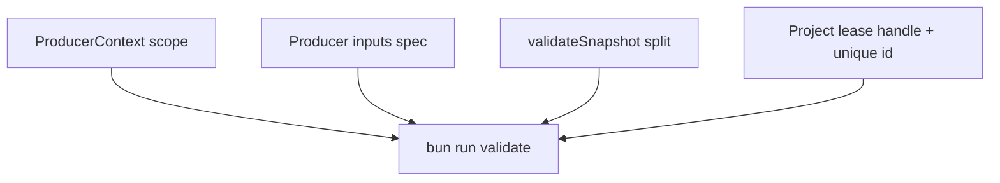

# x00502 — State Engine Phase 0.2 internal closure

## Goal

Cerrar los 4 huecos de coherencia interna que dejó x00501 (Phase 0.1) sobre
`@delendai/state`, ANTES de que `@delendai/state-sqlite` (Phase 1 / q00019)
empiece a persistir el estado. La dirección arquitectónica de Phase 0.1 es
correcta; la distancia entre contrato y comportamiento todavía no es nula.

Esta proposal cierra esa distancia con un único commit, sliceable en 4
sub-slices independientes. Cada uno tiene su gate.

## why

Repaso de los 4 huecos, todos verificados sobre `013d1a07` (develop HEAD):

1. **`ProducerContext.snapshot` sigue exponiendo el snapshot global.** El
   `byProducer` map existe (x00501 S2) pero el producer recibe el snapshot
   completo y puede leer `ctx.snapshot.contents` ajeno. La intención
   documentada (privacidad por producer) NO está cerrada en código.
   **Hue #1 — privacidad.**

2. **`IStateProducer.inputs` sigue siendo `readonly IProducerInput[]`.**
   `IProducerInputSpec` y `IResolvedProducerInput` existen
   (`fingerprint.ts:71-100`) como tipos, pero la API efectiva del producer
   todavía pide el flat legacy. La fingerprint debe derivarse del input
   resuelto, no de un digest congelado al registrar el producer.
   **Hue #2 — separación estático / dinámico.**

4. **`validateSnapshot` documenta 4 checks pero implementa 3.** El contrato
   en `registry.ts:191-211` dice que el check #3 compara el fingerprint del
   snapshot contra `seedFingerprint()` del registry. La implementación en
   `driver-in-memory.ts:574-588` dice explícitamente *"We do NOT compare
   against `seedFingerprint()`"*. Es la divergencia contrato ↔
   comportamiento que el revisor señaló. **Hue #3 — coherencia contrato.**

5. **`acquireProjectLease` devuelve `GenerationFenceOutcome`, no
   `IProjectLeaseHandle`.** El handle existe como contrato
   (`registry.ts:33-39`) y como simétrico de `ISwarmClaimHandle`, pero la
   firma real (`registry.ts:121-127`) devuelve el fence outcome y el caller
   tiene que conocer el `leaseId` por su cuenta. Además el `leaseId` se
   deriva como `project:${kind}:${gen}:${token}` — dos agentes que
   capturen la misma generación con el mismo token producen el mismo
   `leaseId`, lo que rompe la identidad de holder en un swarm > 1.
   **Hue #4 — simetría API + identidad.**

Phase 0.2 cierra los 4 en código. Phase 1 (`q00019`) replica los invariantes
a SQLite shadow; necesita que estos 4 estén verdes primero, si no replica
inconsistencias.

## why this design

- **`IProducerResolvedSnapshot` separado del `IStateInputSnapshot`.** El
  host sigue produciendo `IStateInputSnapshot` (incluye `declared`,
  `byProducer`, `contents`); el producer consume `IProducerResolvedSnapshot`
  que es `byProducer.get(producerId) ?? []`. Privacy cierra en la frontera
  de tipos, no en runtime. `IStateInputSnapshot.contents` deja de estar
  expuesto a producers — sólo el registry lo ve.
- **`IProducerInputSpec[]` en la API del producer + `IProducerInput`
  legacy alias.** El alias sobrevive una fase para compilación, pero
  `IStateProducer.inputs` ya pide spec. El fingerprint del registry se
  deriva de `resolved.spec → spec.key + digest` resuelto por el host, no
  del `inputs[]` declarado.
- **`validateSnapshot` separa `validateSnapshotIntegrity` (auto-consistencia)
  de `validateSnapshotAgainstRegistry` (snapshot.fingerprint vs
  registry.seedFingerprint()).** El driver llama a ambos en orden antes de
  correr producers. La divergencia contrato ↔ comportamiento desaparece.
- **`acquireProjectLease` devuelve `IProjectLeaseHandle` (o `IFenceRejected`
  si rechaza) — simétrico con `acquireSwarmClaim`.** El `leaseId` se
  deriva de un contador atómico `nextProjectLeaseSerial`, no del
  `${kind}:${gen}:${token}` que es colisionable. Dos agentes con la misma
  generación + token obtienen `leaseId`s distintos y son dos holders
  independientes.

## non-goals

- NO introduce SQLite. Phase 1.
- NO migra `proposals/index.json` ni ningún JSON.
- NO cambia el formato de `canonicalHash` ni el de `fingerprint`.
- NO elimina `IProducerInput` legacy alias — sobrevive una fase para
  compilación. Phase 0.3 lo retira.
- NO cambia la API pública de `acquireSwarmClaim` (ya simétrica).
- NO añade lock de hidratación al producer — sigue siendo un valor
  frozen host-supplied.
- NO sincroniza SQLite entre máquinas.

## architecture (after Phase 0.2)

```
                            PROJECT SOURCES
                            Git + dirty overlay
                                   │
                                   ▼
                    IStateInputSnapshot (host-built)
                    ├─ fingerprint
                    ├─ declared
                    ├─ contents
                    └─ byProducer        (Phase 0.2 owned)
                                   │
                                   ▼
                            @delendai/state
                          InMemoryStateRegistry
                          ┌────────────────────────────┐
                          │ validateSnapshot*          │ ← 2 checks
                          │ acquireProjectLease → Handle│ ← symmetric
                          │ acquireSwarmClaim → Handle │ (already)
                          │ seedFingerprint            │ ← compares
                          └────────────────────────────┘
                                   │
                                   ▼
                            IProducerResolvedSnapshot
                            (per-producer slice only)
                                   │
                                   ▼
                            IStateProducer
                            inputs: IProducerInputSpec[]

```

## slices

### S1 — ProducerContext privacy: scope snapshot to producer

- **Status**: pending
- **Files**: `packages/state/src/lib/producer.ts`,
  `packages/state/src/lib/driver-in-memory.ts`,
  `packages/state/tests/src/property/*.spec.ts`
- **Gate**: `typecheck` + `test`
- Introduce `IProducerResolvedSnapshot`:
  - `{ readonly spec: IProducerInputSpec; readonly digest: Sha256Hex;
     readonly content: Uint8Array }` (extends `IResolvedProducerInput`).
- `ProducerContext` reemplaza `snapshot: IStateInputSnapshot` por
  `resolved: readonly IProducerResolvedSnapshot[]` (sólo el slice del
  producer) + `fingerprint` (mantener). El host filtra
  `byProducer.get(producerId)` antes de construir el contexto.
- El driver sigue viendo el `IStateInputSnapshot` completo para
  `validateSnapshot*` — sólo cambia lo que pasa al producer.
- Tests existentes pasan porque hoy leían `ctx.snapshot.contents`;
  cambiarlos a `ctx.resolved`.
- Property tests deben demostrar que un producer que intenta leer
  inputs de otro producer (vía un campo que ya no existe) NO compila.

### S2 — IStateProducer.inputs: IProducerInputSpec + IProducerInput legacy

- **Status**: pending
- **Files**: `packages/state/src/lib/producer.ts`,
  `packages/state/src/lib/fingerprint.ts`,
  `packages/state/src/lib/driver-in-memory.ts`,
  `packages/state/tests/src/{fingerprint,registry,generation}.spec.ts`
- **Gate**: `typecheck` + `test`
- `IStateProducer.inputs: readonly IProducerInputSpec[]` (en lugar de
  `readonly IProducerInput[]`).
- `fingerprintEntryOf` deriva de los specs declarados; el fingerprint
  final se computa en `seedFingerprint()` usando los resolved digests
  que el host pasa vía `IHydrateInput.snapshot`, no los specs estáticos.
- `IProducerInput` se conserva como `type IProducerInput = IProducerInputSpec &
  { digest: Sha256Hex }` para no romper imports externos.
- Los tests que hoy declaran `inputs: [{ ..., digest: '...' }]` se
  migran a `inputs: [{ ... }]` (spec) más un `resolved: [{ spec,
  digest, content }]` externo.

### S3 — validateSnapshot: separar Integrity vs AgainstRegistry

- **Status**: pending
- **Files**: `packages/state/src/lib/registry.ts`,
  `packages/state/src/lib/driver-in-memory.ts`,
  `packages/state/tests/src/registry.spec.ts`
- **Gate**: `typecheck` + `test`
- Contrato:
  - `validateSnapshotIntegrity(snapshot)` — auto-consistencia
    (orphan contents, declared keys ∩ content keys, byProducer coherente).
  - `validateSnapshotAgainstRegistry(snapshot)` — compara
    `snapshot.fingerprint` contra `seedFingerprint()`. Emite
    `fingerprint_mismatch` cuando difieren estructuralmente.
  - `validateSnapshot(snapshot)` queda como fachada que llama a ambos
    y concatena issues. Hoy es alias del primero.
- Implementación:
  - `validateSnapshotAgainstRegistry` usa `fingerprintEqual` (ya existe)
    sobre el `snapshot.fingerprint` vs `this.seedFingerprint()`.
  - El driver llama a `validateSnapshot` antes de correr producers (igual
    que hoy).
- Test: snapshot con fingerprint divergente del registry → issue
  `fingerprint_mismatch`. Test inverso: snapshot consistente → issue
  vacía.

### S4 — acquireProjectLease: IProjectLeaseHandle simétrico + leaseId único

- **Status**: pending
- **Files**: `packages/state/src/lib/registry.ts`,
  `packages/state/src/lib/generation.ts`,
  `packages/state/src/lib/driver-in-memory.ts`,
  `packages/state/tests/src/{registry,generation}.spec.ts`
- **Gate**: `typecheck` + `test`
- `acquireProjectLease(args)` devuelve
  `IProjectLeaseHandle | IFenceRejected`. Si el fence rechaza, el
  caller obtiene `IFenceRejected` (mismo envelope que
  `GenerationFenceOutcome` pero tipado como `IFenceRejected` puro).
- `IProjectLeaseHandle`:
  - `readonly generationId: IGenerationId`
  - `readonly token: IProjectLeaseToken`
  - `readonly leaseId: string` (único por adquisición)
  - `release(): void`
- `leaseId` se deriva de `state.nextProjectLeaseSerial` (contador
  atómico nuevo) en lugar de `${kind}:${gen}:${token}`. Dos adquisiciones
  consecutivas con el mismo `(gen, token)` obtienen leaseIds distintos
  (`p000001`, `p000002`).
- `releaseProjectLease({ leaseId })` se mantiene.
- Test de simetría: `acquireProjectLease` × 2 con misma `(gen, token)`
  → dos handles con leaseIds distintos, ambos holders válidos,
  `release` por separado.
- Test de rechazo: `(gen, token)` stale → `IFenceRejected` con
  `STALE_PROJECT_GENERATION` y `currentToken` correcto.

## dependency graph



Las 4 son independientes en el sentido de archivos, pero S4 depende de la
intención del contrato en S3 (ambos comparten el patrón `IFenceRejected`
vs `GenerationFenceOutcome`). El orden recomendado es S3, S1, S2, S4 —
pero el swarm puede reordenarlas porque ninguna bloquea a otra.

## acceptance

- [ ] `bunx tsc --noEmit -p tsconfig.json` verde.
- [ ] `bun tools/scripts/lint/no-node-imports-in-state.script.ts`
      → 0 violaciones.
- [ ] `bunx vitest run --cwd packages/state`:
  - `producer.spec.ts`: un producer que recibe `ctx` NO puede
    `ctx.snapshot.contents` (no compila) y SÍ puede iterar
    `ctx.resolved`.
  - `fingerprint.spec.ts`: fingerprint derivado de specs declarados
    coincide con fingerprint derivado de resolved specs (mismo
    `canonicalStateHash`).
  - `registry.spec.ts`:
    - `validateSnapshot(internalConsistent)` → 0 issues.
    - `validateSnapshot(fingerprintMismatch)` → `fingerprint_mismatch`.
  - `generation.spec.ts`:
    - `acquireProjectLease` × 2 misma `(gen, token)` → 2 handles
      con leaseIds distintos, ambos holders válidos.
    - `acquireProjectLease` con token stale → `IFenceRejected`
      con `currentToken` correcto.
    - `release({ leaseId })` decrementa exactamente el holder que
      creó ese leaseId.
- [ ] `IProducerInput` sigue compilando como alias legacy (no se
  rompe ningún import externo).
- [ ] Conventional Commit (`fix(state): phase 0.2 internal closure
  — producer context scope, input spec split, snapshot
  validation split, project lease handle symmetry`).

## risks and mitigations

- **Riesgo**: la separación `Integrity` vs `AgainstRegistry` añade
  un check más y los property tests fallan por snapshots con
  fingerprints que ya no coinciden. → **Mitigación**: los tests
  fixture usan `snapshotFromResolved(resolved, registry)` (que
  ya deriva el fingerprint del registry); con Phase 0.2 cierran
  sin cambios adicionales.
- **Riesgo**: cambiar `ProducerContext.snapshot` por `resolved`
  rompe producer plugins que ya lean `ctx.snapshot`. → **Mitigación**:
  hoy no hay producer plugins externos; los únicos callers son los
  property tests internos, que se migran en este commit.
- **Riesgo**: el contador atómico para `leaseId` requiere un
  `nextProjectLeaseSerial` separado de `nextProjectLeaseToken`. →
  **Mitigación**: ya tenemos `nextProjectLeaseToken`; añadimos
  `nextProjectLeaseSerial` adyacente. Los dos crecen juntos, no
  comparten números (token sigue siendo monotónico por generación,
  serial monotónico por scope).
- **Riesgo**: el lint detecta falsos positivos sobre doc-comments
  en las nuevas interfaces. → **Mitigación**: el lint ya strip-comments
  en Phase 0.1.

## notes

- `x00501` (done) — Phase 0.1 correction slice. Esta proposal cierra
  los 4 huecos que x00501 dejó pendientes en su revisión externa.
- `q00018` (ready/plans) — plan Phase 0 → Phase 6. x00502 es la
  Phase 0.2 que el plan menciona.
- `q00019` (ready/plans) — Phase 1 SQLite shadow driver. No se
  empieza hasta que x00502 esté verde. La condición está documentada
  en el plan.
- `f00073` (done) — double-prefix fix. Cubierto.
- `c00012` (done) — agentes no deben panic. La coherencia
  Phase 0.2 reduce la superficie de "diferencias internas" que un
  agente puede encontrar.
- `x00428` (in-progress) — worktree path authority. Sin cambios
  en Phase 0.2; requerido por Phase 5 de q00018.

### Post Phase 0.2 roadmap

Phase 0.2 verde → `q00019` (Phase 1 SQLite shadow) puede arrancar.
La condición "Phase 0.1 + 0.2 verde antes de persistir" es ahora
automática vía `bun run validate`.