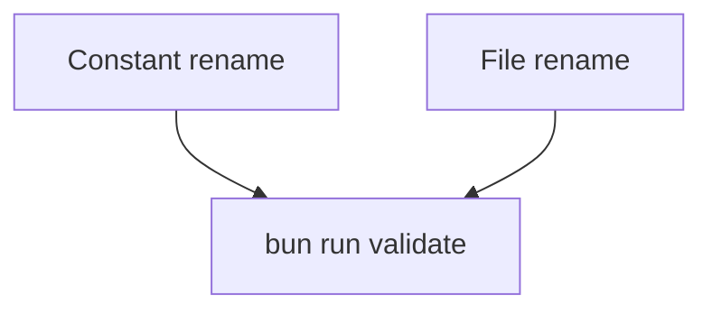

# x00503 — Nomenclature final polish

## Goal

Cerrar los 2 residuos de nomenclatura que la migración
`vertex → project-signal` (commit `762b0c0c0` +
`8279e12ed`) dejó pendientes, y alinear el nombre de fichero
interno con el nombre semántico del símbolo exportado.

El agente de nomenclatura (parallel worker) terminó la mayor
parte de la migración. Estos dos son los últimos residuos
mecánicos:

1. **`DEFAULT_VERTEX_CONFIG_RULES` → `DEFAULT_PROJECT_SIGNAL_RULES`.**
   La constante exportada en
   `packages/core/src/lib/bootstrap/project-signal-rules.ts:67`
   todavía lleva el nombre legacy `VERTEX`, aunque el fichero
   se llama `project-signal-rules.ts`, los tipos son
   `IProjectSignalRule`, y los callers usan
   `matchProjectSignalConfig`. Es la única pieza del módulo
   inconsistente.

2. **`vertex-router.tool.ts` → `compact-router.tool.ts`.** El
   fichero exporta `buildCompactRouterToolRegistration`, su
   descripción es "Compact router over the loaded tool surface",
   y `id: 'vertex'` ya se mantiene explícitamente como
   identificador público compatible. El nombre de fichero no
   aporta — sólo confunde.

El criterio aplicado:

```
nombre interno (fichero, constante, función)
   ↓
debe describir la responsabilidad actual

identificador público (tool id, protocol name, datos persistidos)
   ↓
estable para compatibilidad
```

## why

- `DEFAULT_VERTEX_CONFIG_RULES` está en 5 sitios en el código +
  tests + `.d.ts` regenerados. Una grep rápida:

  ```
  $ grep -rn 'DEFAULT_VERTEX_CONFIG_RULES' --include='*.ts' \
      packages/ plugins/
  packages/core/tests/src/lib/bootstrap/project-signal-rules.spec.ts:8
  packages/core/tests/src/lib/bootstrap/project-signal-rules.spec.ts:19
  packages/core/tests/src/lib/bootstrap/project-signal-rules.spec.ts:21
  packages/core/tests/src/lib/bootstrap/project-signal-rules.spec.ts:25
  packages/core/tests/src/lib/bootstrap/project-signal-rules.spec.ts:28
  packages/core/src/lib/bootstrap/project-signal-rules.ts:67
  packages/core/src/lib/bootstrap/project-signal-rules.ts:94
  packages/core/src/lib/bootstrap/project-signal-rules.ts:112
  packages/core/src/lib/bootstrap/project-signal-rules.d.ts:10
  packages/core/src/src/lib/bootstrap/project-signal-rules.d.ts:10
  ```

  Las 5 referencias del `.ts` (1 declaración + 2 usos como default
  param + 2 en tests) son 1 commit slice. El `.d.ts` se regenera.

- `vertex-router.tool.ts` está en 1 sitio + 1 importer:

  ```
  $ find . -name 'vertex-router.tool.ts' \
      -not -path './node_modules/*' -not -path './build/*'
  packages/core/src/lib/tools/vertex-router.tool.ts

  $ grep -rn 'from.*vertex-router' --include='*.ts' \
      packages/ plugins/ apps/ extensions/
  packages/core/src/lib/cli/assemble-core-tools.ts:84: \
    import { buildCompactRouterToolRegistration } \
    from '../tools/vertex-router.tool';
  ```

  Es 1 rename + 1 import update. El `id: 'vertex'` y
  `${namespacePrefix}_vertex` se quedan como están.

## why this design

- La constante `DEFAULT_PROJECT_SIGNAL_RULES` ya tiene su lugar
  natural: mismo nombre que el tipo y la función, mismo módulo.
  No hay riesgo semántico — el módulo entero ya migró.
- El fichero `compact-router.tool.ts` se alinea con la
  descripción interna ("Compact router over the loaded tool
  surface"). Mantener `id: 'vertex'` es deliberado:
  `vertex` es el identificador público, no el nombre del
  componente.
- No hace falta forwarding module temporal. Hay 1 importer;
  se actualiza en el mismo commit.

## non-goals

- NO elimina el tool id `'vertex'` ni
  `${namespacePrefix}_vertex`. Compatibilidad.
- NO migra ningún otro módulo. La migración está cerrada;
  sólo faltan estos 2 residuos.
- NO renombra la constante `vertex-router-tool` ni ningún
  identificador que aún viva en runtime configs (config
  persistida, snapshots, etc.).
- NO toca plugins ni apps. Los únicos importers están en
  `packages/core`.

## slices

### S1 — `DEFAULT_VERTEX_CONFIG_RULES` → `DEFAULT_PROJECT_SIGNAL_RULES`

- **Status**: done
- **Files**:
  `packages/core/src/lib/bootstrap/project-signal-rules.ts`,
  `packages/core/tests/src/lib/bootstrap/project-signal-rules.spec.ts`
- **Gate**: `typecheck` + `test`
- Renombrar la constante exportada.
- Actualizar 2 default-param callers (`matchProjectSignalConfig`
  y `matchProjectSignalConfigFromRaw`).
- Actualizar el `describe()` y los `DEFAULT_VERTEX_CONFIG_RULES.*`
  en el spec.
- Regenerar los `.d.ts` vía el script canónico
  (`bun tools/scripts/compile/build.script.ts packages/core`).
- NO requiere commit-policy `chore:` por sí solo — se acumula
  con S2 en un único commit fix.
- review-state: done
- review-implementer: delendai-impl-20260906
- review-reviewer: delendai-reviewer-20260906
- review-log: approved by delendai-reviewer-20260906 — Independent verification: grep -rn 'DEFAULT_VERTEX_CONFIG_RULES' packages/core returns 0 hits; spec passes 16/16; rename is mechanically complete.
### S2 — `vertex-router.tool.ts` → `compact-router.tool.ts`

- **Status**: done
- **Files**:
  `packages/core/src/lib/tools/vertex-router.tool.ts`,
  `packages/core/src/lib/tools/compact-router.tool.ts` (new),
  `packages/core/src/lib/cli/assemble-core-tools.ts`
- **Gate**: `typecheck` + `test`
- `git mv vertex-router.tool.ts compact-router.tool.ts`.
- Actualizar el único importer en
  `packages/core/src/lib/cli/assemble-core-tools.ts:84`.
- Mantener `id: 'vertex'` y `${namespacePrefix}_vertex`
  dentro del cuerpo.
- Regenerar los `.d.ts` vía el script canónico.
- review-state: done
- review-implementer: delendai-impl-20260906
- review-reviewer: delendai-reviewer-20260906
- review-log: approved by delendai-reviewer-20260906 — Independent verification: git status shows 'R' for vertex-router → compact-router; importer updated; typecheck green; CLI meta-tools spec passes 11/11.
## dependency graph



Las 2 son independientes en el sentido de líneas tocadas. El
swarm puede ejecutarlas en paralelo; las reunimos en un único
commit `fix(core):` al final.

## acceptance

- [ ] `bunx tsc --noEmit -p tsconfig.json` verde.
- [ ] `grep -rn 'DEFAULT_VERTEX_CONFIG_RULES\|vertex-router.tool' \
       --include='*.ts' packages/ plugins/ apps/ extensions/`
      → 0 resultados.
- [ ] `grep -rn 'DEFAULT_PROJECT_SIGNAL_RULES\|compact-router.tool' \
       --include='*.ts' packages/ plugins/ apps/ extensions/`
      → ≥ 5 resultados (constante + 2 default params + 1 spec +
        1 importer actualizado).
- [ ] `bunx vitest run --cwd packages/core`:
  - `tests/src/lib/bootstrap/project-signal-rules.spec.ts` pasa con
    el `describe()` renombrado.
  - `tests/src/lib/cli/core-meta-tools.spec.ts` (si verifica el
    router) sigue verde — el `id: 'vertex'` no cambió.
- [ ] `bun tools/scripts/compile/build.script.ts packages/core` →
  `dist/lib/tools/compact-router.tool.js` existe, no
  `vertex-router.tool.js`.
- [ ] Conventional Commit
  (`fix(core): complete vertex→project-signal rename — DEFAULT_PROJECT_SIGNAL_RULES + compact-router.tool.ts`).

## risks and mitigations

- **Riesgo**: hay `compact-router` en otro módulo (un plugin, una
  app) que colisiona con el nuevo filename. → **Mitigación**: el
  search antes del rename (`find . -name 'compact-router*'`) debe
  ser 0; si no, lo paramos.
- **Riesgo**: algún binario cacheado en `build/` todavía
  importa `vertex-router`. → **Mitigación**: `build/` está
  en `.gitignore` y se regenera en cada `bun run build`; no
  afecta a `bun run validate` que resuelve `@delendai/source`.
- **Riesgo**: el script de lint detecta el nombre antiguo en un
  doc-comment de un plugin que mencione la constante legacy.
  → **Mitigación**: el lint ya strip-comments desde x00501 S8.

## notes

- `x00425` (in-progress) — eliminar identificadores de propuestas
  incrustados en comentarios de código. Sin cambios en x00503;
  no los confunde: `x00503` no menciona ids en código.
- `x00426` (in-progress) — eliminar shim shell obsoleto del locale
  de lefthook. Sin cambios.
- `x00427` (in-progress) — push reconcilia estado de rama. Sin
  cambios.
- `r00040` (ready) — migrar el barrel de 288 exports a los
  subpaths del core. Sin cambios; si toca los mismos paths,
  x00503-S2 se ejecuta antes.
- `7709a3f13` (merged) — `feat(lint): add i18n-english-prose gate`.
  El lint no necesita actualizarse; `DEFAULT_VERTEX_CONFIG_RULES`
  es identificador, no prosa.

### Post cleanup

Esta proposal cierra la cola de nomenclatura que dejó el
rebranding. No esperamos más renames mecánicos sobre
`vertex`. Si surge uno nuevo, se trata como propuesta
separada — no se acumula con x00503.