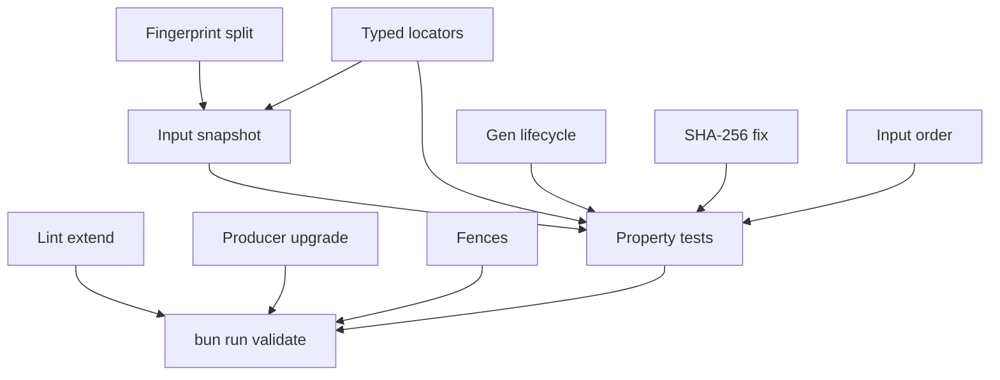

# x00501 — State Engine Phase 0.1 correction slice

## Goal

Corregir los 10 hallazgos estructurales que el revisor externo
identificó en el commit `99d17f26d` (Phase 0), antes de empezar
`@delendai/state-sqlite` (Phase 1 de q00018).

El veredicto del revisor fue nítido:

> La dirección arquitectónica es buena. La implementación del
> 99d17f26d es aproximadamente el esqueleto correcto. Pero los
> tests actuales dan la impresión de demostrar los invariants
> cuando en realidad demuestran versiones bastante más débiles.

Phase 0.1 cierra esa distancia. Phase 1 (SQLite) sólo debe
arrancar cuando Phase 0.1 esté verde.

## why

Repaso de los 10 hallazgos, todos verificados sobre `99d17f26d`:

1. **`scopeKey` mezcla `workspaceRoot` en la identidad de `swarm`**
   → dos worktrees del mismo repo producen keys distintas
   aunque compartan `swarmRoot`. Era un bug estructural. S4.
2. **El `ProjectFingerprint` se construía con `salt = workspace.root`**
   en `assemble.ts`, contradiciendo su propio invariant. S1.
3. **Los property tests no probaban lo que decían**:
   "incremental ≡ cleanRebuild" comparaba dos registries que
   ambos re-ejecutaban las ops; "corruption recovery" hacía
   `resetForTests()` y volvía a replayar. S3.
4. **`hydrate()` pasaba un `inputContents` siempre vacío** →
   ningún producer real podía reconstruir desde fuentes. S2.
5. **`__inline__` mutation del active generation** contradecía
   "generations are immutable once published". Las generaciones
   viejas podían quedarse permanentemente `draining`. S5.
6. **SHA-256 con length trailer en orden LOW/HIGH en lugar de
   HIGH/LOW** → el hash calculado NO es SHA-256 estándar. S6.
7. **Inputs en los fingerprints eran order-sensitive** en lugar
   de SET semantics. S7.
8. **El lint cubría sólo `packages/state/src`** y no
   `plugins/*/src/lib/state/**` (donde aparecerán los producers).
   S8.
9. **`defineProducer` upgrade path** lanzaba
   `[state] unreachable: scopeKindFromState`. S9.
10. **Fencing API mezclaba project fences y swarm fences**.
    Además `IStateProducer` no exponía `projectionSchema` para
    validación. S10 + S2.

Phase 0.1 cierra los 10 en un único commit sliceable. Cada uno
tiene su sub-slice y su gate.

## why this design

- **Locators tipados por kind** en lugar de un bag con campos
  opcionales. Hace irrepresentables combinaciones inválidas
  (`project + swarmRoot`, `swarm + workspaceRoot`, …). Reduce la
  API del registry a cuatro formas explícitas.
- **`CanonicalProjectFingerprint` vs `StateStorageIdentity`** son
  dos tipos distintos. El primero decide convergencia; el
  segundo decide DÓNDE leer/escribir. Mezclarlos es lo que metió
  `workspace.root` en el hash canónico.
- **`IStateInputSnapshot`** es un valor host-supplied, frozen. El
  driver nunca lee `fs`; el host computa los digests antes de
  la llamada. Esto evita el TOCTOU "hashear el archivo luego
  leerlo".
- **Generaciones puramente inmutables + leases refcounted**:
  el GC test demanda `reaped >= 1` y verifica que el activo
  sobrevive.
- **Fences separados**: `acquireProjectLease` /
  `acquireSwarmClaim` / `renewSwarmClaim`. Las dos garantías
  (proyecto stale vs swarm slot reassigned) son distintas;
  mezclarlas era un anti-pattern de la v0.
- **SHA-256 con vector test FIPS 180-4** (`""` y `"abc"`). El
  Phase 0 los pasaba porque nadie los comparaba contra un
  estándar.
- **Inputs como SET canónico**: dos producers que declaran
  `{A, B}` y `{B, A}` son el mismo producer. No necesitamos
  orden para fingerprinting.

## non-goals

- NO introduce SQLite ni dependencia nativa alguna. Phase 1.
- NO migra `proposals/index.json` ni ningún otro JSON.
- NO toca `syncProposalRegistry()` ni el reconciliador legacy.
- NO mueve coordinación del swarm a SQLite.
- NO sincroniza SQLite entre máquinas.
- NO cambia el path canónico de worktrees (x00428 ya lo arregló).
- NO introduce Zod. La `validateProjection` del producer
  devuelve un `IProjectionValidationResult` puro; cada plugin
  decide cómo validar (puede usar Zod si lo trae el plugin; el
  paquete `@delendai/state` se queda sin dep).

## architecture (cambios respecto Phase 0)

```
                                  PROJECT SOURCES
                                  Git + dirty overlay
                                         │
                                         ▼
                              CanonicalProjectFingerprint       (NO path, NO branch,
                              StateStorageIdentity  ─────►       NO hostname, NO time)
                              IStateInputSnapshot    ──host──►
                                         │
                                         ▼
                              @delendai/state
                            InMemoryStateRegistry
                            ┌────────────────────────────┐
                            │ acquireProjectLease        │ (project fence)
                            │ acquireSwarmClaim / renew  │ (swarm fence)
                            └────────────────────────────┘
                                         │
                                         ▼
                              generations (immutable)
                              active → draining → reaped
                              GC reaps when holders.size === 0
```

## slices

### S1 — Fingerprint canónico sin salt/storage

- **Status**: pending
- **Files**: `packages/state/src/lib/fingerprint.ts`, `packages/state/tests/src/fingerprint.spec.ts`
- **Gate**: `typecheck` + `test`
- Reemplaza `ProjectFingerprint` por `CanonicalProjectFingerprint`
  (sin `salt`). Introduce `StateStorageIdentity` independiente.
- `fingerprintFromProducers(producers, abi)` helper.
- `canonicalizeInputs` / `canonicalizeProducers` normalizan
  orden.
- `fingerprintEqual` opera sobre el resultado canonicalizado.

### S2 — `IStateInputSnapshot` host-supplied + producer context

- **Status**: pending
- **Files**: `packages/state/src/lib/producer.ts`, `packages/state/src/lib/registry.ts`
- **Gate**: `typecheck` + `test`
- `IHydrateInput` reemplaza `IHydrateArgs`. Aporta `snapshot`
  congelado (fingerprint + contents + declared).
- `ProducerContext` reemplaza `IProducerContext`, con
  `snapshot` en lugar de `inputContents`.
- `IStateProducer.validateProjection?` opcional para validación
  post-rebuild/post-reconcile.
- `IHydrateResult` se renombra `HydrateResult` /
  `HydrateFailureReason` (`'snapshot_unavailable'`,
  `'projection_invalid'`).

### S3 — Property tests con semantic real

- **Status**: pending
- **Files**: `packages/state/tests/src/property/{equivalence,determinism,corruption}.spec.ts`
- **Gate**: `test`
- `equivalence`: registry A replaya todas las ops; registry B
  hace `hydrate(finalSnapshot)` SIN replay. La condición pasa
  sólo si `hash(A) === hash(B)`.
- `corruption`: simula corruption + `resetForTests()` y
  reconstruye desde el snapshot final (sin replay).
- `determinism`: añade el caso NEGATIVO: un producer que usa
  `Date.now()` rompe la propiedad. (Esto es la regression
  guard que el lint protege dinámicamente.)

### S4 — Locators tipados por scope kind

- **Status**: pending
- **Files**: `packages/state/src/lib/scope.ts`, `packages/state/src/lib/driver-in-memory.ts`
- **Gate**: `typecheck` + `test`
- Tipos `IProjectLocator`, `ISwarmLocator`,
  `ISharedContentCacheLocator`, `IWorktreeCacheLocator`.
- `IStateScope` → `StateScope` (union discriminada).
- `scopesEqual` se refactoriza por branch del discriminated
  union.
- `scopeStateKey` (interno al driver) indexa por campos de
  identidad del kind correspondiente; `swarm` y
  `shared-content-cache` NO incluyen `workspaceRoot`.

### S5 — Generation lifecycle correcto + GC verificable

- **Status**: pending
- **Files**: `packages/state/src/lib/generation.ts`, `packages/state/src/lib/driver-in-memory.ts`
- **Gate**: `typecheck` + `test`
- Eliminado `__inline__`. Las generaciones activas son
  inmutables. Una mutación publica una nueva generación.
- `generation.holders` es un `Map<string, IRegistryHolder>`
  real, refcounted. Se incrementa al
  `acquireProjectLease` / `acquireSwarmClaim` y se decrementa
  en `release*`.
- `gc()` reapa cuando `status === 'draining' && holders.size === 0`.
  El test exige `reaped >= 1` y verifica que la activa
  sobrevive.

### S6 — SHA-256 endianness + vectors FIPS 180-4

- **Status**: pending
- **Files**: `packages/state/src/lib/hash.ts`, `packages/state/tests/src/hash.spec.ts`
- **Gate**: `typecheck` + `test`
- El trailer de 64 bits se escribe HIGH 32 bits THEN LOW 32
  bits (FIPS 180-4 §5.1.1).
- Test contra los vectores estándar:
  - `sha256("") === e3b0c44298fc1c149afbf4c8996fb92427ae41e4649b934ca495991b7852b855`
  - `sha256("abc") === ba7816bf8f01cfea414140de5dae2223b00361a396177a9cb410ff61f20015ad`
- `SHA256_STANDARD_VECTORS` exportado para futuros tests.

### S7 — Input order canonicalisation

- **Status**: pending
- **Files**: `packages/state/src/lib/fingerprint.ts`, `packages/state/tests/src/fingerprint.spec.ts`
- **Gate**: `test`
- `compareInputKey` ordena por `(kind, locator, parserVersion)`
  ascendente. `canonicalizeInputs` produce la lista ordenada.
- Test: dos producers con `{A, B}` y `{B, A}` →
  `fingerprintEqual` devuelve `true`.

### S8 — Lint extendido a plugin producers

- **Status**: pending
- **Files**: `tools/scripts/lint/no-node-imports-in-state.script.ts`
- **Gate**: `lint`
- La lint ahora recorre dos raíces:
  - `packages/state/src` (igual que antes)
  - `plugins/<name>/src/lib/state/` (sólo cuando existe)
- `Date.now`, `Math.random`, `crypto.randomBytes`,
  `performance.now`, `process.env`, `process.cwd` etc. siguen
  prohibidos.
- Strips comments antes de scan para que doc-comments que los
  mencionen no disparen falsos positivos.

### S9 — `defineProducer` upgrade path

- **Status**: pending
- **Files**: `packages/state/src/lib/driver-in-memory.ts`, `packages/state/tests/src/registry.spec.ts`
- **Gate**: `test`
- `defineProducer` permite registrar un `producerVersion` nuevo
  para el mismo `id`; no llama a `scopeKindFromState` (esa
  función ya no existe).
- Test cubre el upgrade explícitamente.

### S10 — Fences separados + `validateProjection`

- **Status**: pending
- **Files**: `packages/state/src/lib/generation.ts`, `packages/state/src/lib/registry.ts`, `packages/state/tests/src/registry.spec.ts`
- **Gate**: `test`
- `ProjectLeaseToken` y `SwarmLeaseToken` son tipos distintos
  (a nivel runtime son `number`, pero el type system no permite
  intercambiarlos).
- API: `acquireProjectLease` / `releaseProjectLease` /
  `acquireSwarmClaim` / `renewSwarmClaim`. Razones de
  rechazo: `STALE_PROJECT_GENERATION`,
  `PROJECT_GENERATION_NOT_ACTIVE`, `STALE_SWARM_LEASE`,
  `SWARM_LEASE_REVOKED`.
- `IStateProducer.validateProjection?` se ejecuta post
  `rebuild` / `reconcile`; si devuelve issues, la
  generación falla con `'projection_invalid'`.

## dependency graph



## acceptance

- [ ] `bunx tsc --noEmit -p tsconfig.json` verde.
- [ ] `bun tools/scripts/lint/no-node-imports-in-state.script.ts`
      → 0 violaciones, incluso si añado un nuevo
      `plugins/foo/src/lib/state/producer.ts` con un
      `Date.now()`.
- [ ] `bunx vitest run --cwd packages/state`:
  - `sha256Hex('')` produce
    `e3b0c44298fc1c149afbf4c8996fb92427ae41e4649b934ca495991b7852b855`.
  - `sha256Hex('abc')` produce
    `ba7816bf8f01cfea414140de5dae2223b00361a396177a9cb410ff61f20015ad`.
  - `equivalence.spec.ts`: 200 secuencias de ops aleatorias,
    hash(incremental) === hash(rebuild-from-final-snapshot).
  - `corruption.spec.ts`: 200 secuencias de strings aleatorios,
    hash(healthy) === hash(rebuild-after-corruption).
  - `determinism.spec.ts`: 200 secuencias de ops,
    hash(registry A) === hash(registry B); el caso negativo
    `Date.now()` rompe la propiedad.
  - `scope.spec.ts`: dos scopes `swarm` con mismo
    `repositoryInstanceId` → iguales; con distinto →
    desiguales.
  - `generation.spec.ts`: `gc(scope)` devuelve >= 1 y la
    activa sobrevive.
  - `registry.spec.ts`: `defineProducer` con `producerVersion`
    distinto NO lanza; `acquireProjectLease` con generationId
    obsoleto devuelve `STALE_PROJECT_GENERATION`; los swarm
    claims son independientes.
- [ ] `assemble.ts` ya no pasa `defaultSalt: workspace.root`
  (eliminado en S1).
- [ ] Conventional Commit (`fix(state): phase 0.1 correction
  slice …`).

## risks and mitigations

- **Riesgo**: los property tests fallen en CI por no-determinismo
  del global state → **Mitigación**: el driver exige un clock
  inyectado; los tests pasan un contador fijo. Los seeds de
  fast-check son deterministas cuando se inyecta una seed explícita.
- **Riesgo**: la lint extendida dispara falsos positivos sobre
  doc-comments de plugins → **Mitigación**: strip-comments ya
  aplicado en Phase 0; verificado.
- **Riesgo**: SQLite tarda en llegar porque la API cambió →
  **Mitigación**: esta corrección es exactamente lo que evita
  una migración de ABI cuando lleguemos a persistir el
  `canonicalHash`. Es la inversa del riesgo.

## notes

- `q00018` (ready) — el plan Phase 0 → Phase 6. Esta proposal
  es la "Phase 0.1" anunciada como suspendida en §roadmap.
- `x00428` (in-progress) — worktree path authority,
  pre-requisito externo (sin cambios en Phase 0.1; requerido
  por Phase 5 de q00018).
- `f00073` (done) — double-prefix fix, ya cubierto.
- `q00006` (done) — cross-agent ordering, respetado.
- `c00012` (done) — agents must not panic, el State Engine
  refuerza con corruption recovery.

## roadmap (post Phase 0.1)

Phase 0.1 verde → abrir `@delendai/state-sqlite` (Phase 1 de
q00018) como propuesta separada. No se empieza Phase 1 hasta
que esta proposal esté cerrada y merged.
