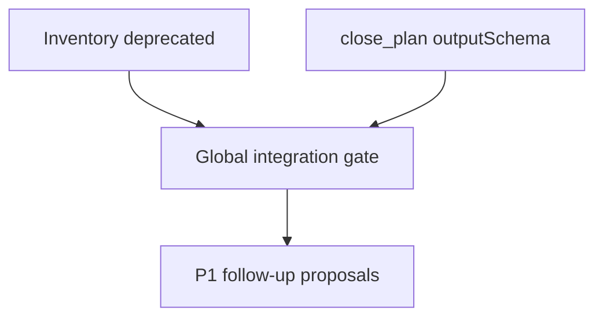

# q00012 — Plan de estabilizacion post-auditoria

## Goal

Devolver coherencia a los contratos publicos, la superficie MCP y los gates de calidad del snapshot auditado el 2026-08-29, sin absorber ni reescribir el trabajo concurrente de `x00298`.

## why

El snapshot no es publicable: la suite global falla en dos contratos y Biome reporta deuda existente. Las dos correcciones P0 restauran contratos verificables antes de abordar el seguimiento P1.

## why this design

Las hijas separan ownership por archivo y permiten validar cada contrato con un test dirigido antes de ejecutar la integracion global.

## non-goals

- No corregir ReDoS de `x00298`.
- No reformatear masivamente el repositorio.
- No cambiar politicas remotas de ramas sin evidencia de GitHub.
- No introducir una reescritura arquitectonica.

## architecture

Una unica composition root debe mantener alineados source, registrations runtime, inventory y artefactos generados.

## slices

### S1 — Corregir contratos P0

- **Status**: pending
- **Files**: `packages/core`, `plugins/proposals`, `tools/scripts`
- **Gate**: `bun run test`
- Ejecutar `x00300` y `x00305` en paralelo con ownership disjunto.
- Ejecutar gates dirigidos de cada hija.

### S2 — Integracion y seguimiento

- **Status**: pending
- **Files**: `docs/delendai/proposals`, `tools/scripts`
- **Gate**: `bun run validate`
- Ejecutar build y suite global.
- Activar o crear propuestas P1 para F-003, F-004 y F-005.
- Cerrar el plan solo con evidencia de todos los criterios.

## dependency graph

## acceptance

- [ ] `nodeDynamicImport` aparece una vez en el inventory con madurez `deprecated`.
- [ ] `proposals_close_plan` aparece en runtime con `outputSchema` y sus dos formas de exito validan.
- [ ] Tests dirigidos, typecheck y build pasan.
- [ ] Suite global no tiene los dos fallos observados.
- [ ] Biome queda verde o cubierto por baseline ratchet explicito.
- [ ] F-004 y F-005 tienen propuestas o quedan demostrablemente descartados.
- [ ] No se atribuyen cambios de `x00298` a este plan.

## risks and mitigations

  - Revertir cada hija en su commit aislado sin tocar archivos de `x00302`.
- No usar reset destructivo sobre el working tree compartido.

## notes

- HEAD: `9c3ed108`
- Rama: `wip/x00298-s1` (histórico del trabajo que ahora está identificado como `x00302`)
- Working tree: sucio, con cambios de varios agentes.
- Tests: 8701 pass, 2 fail, 2 skipped.
- Build: 56 paquetes construidos.
- Biome: 55 errores, 116 warnings, 130 infos.
