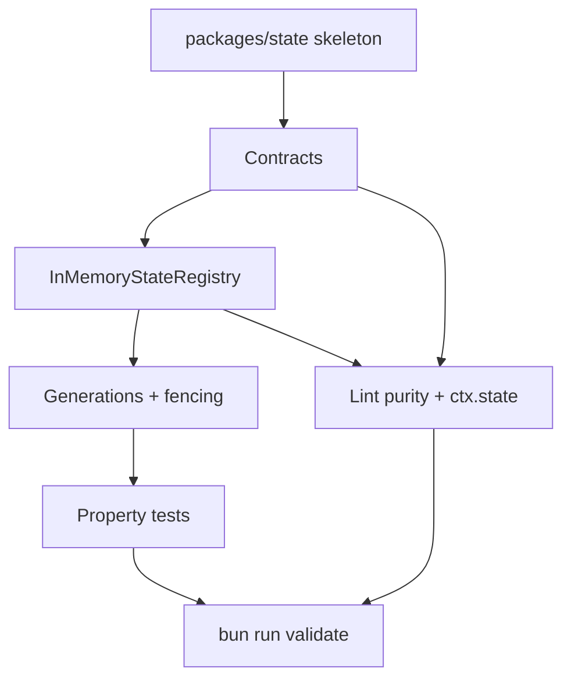

# q00018 — State Engine foundation

## Goal

Que `@delendai/core` (y los plugins que dependen de él) puedan
construir y consultar **estado de proyecto** y **estado de swarm** a
través de un motor común, determinista y reconstruible, con cuatro
ámbitos explícitos (project · swarm · shared-content-cache ·
worktree-cache) y la garantía dura de que:

> hidratar, regenerar, reconciliar, recuperar y reparar estado
> son operaciones **puras respecto al proyecto**. Sólo escriben
> dentro del cache de DelendAI. Nunca tocan Git, Markdown,
> código ni configuración durable.

Phase 0 (este plan, S1–S6) entrega los **contratos**, un driver en
memoria y el guardrails de pureza. Phases 1–6 son propuestas
independientes que se apoyan en estos cimientos.

## why

El enjambre de DelendAI ya coordina agentes con varios mecanismos
distribuidos: locks de archivo, registry, queue, agents.json,
agent-names.json, checkpoints, decisions, proposal-index, integration
pending. Hoy son archivos JSON protegidos por `withFileMutex` y
`writeFileAtomic`. El propio `.gitignore` documenta el coste real:

> los `.mutex` temporales llegaron a competir con operaciones
> Git, bloquear pushes e incluso provocar la pérdida de un lote
> de trabajo ya terminado.

Eso no es una queja estética. Es la señal de que ya estamos
implementando manualmente propiedades de una base de datos (atomic
writes, cuarentena, índices regenerables, reconciliación, tests de
carrera). Generalizar esa infraestructura en un **State Engine
único** es más barato que añadir el mecanismo N+1.

Y hay una segunda razón, igualmente importante: DelendAI tiene hoy
varios reconciliadores con poderes distintos. `syncProposalRegistry()`
no es un indexador: mueve proposals entre directorios, ajusta
frontmatter, resuelve `blocked → ready`, archiva completadas y
corrige nombres. Tiene sentido como mantenimiento de proposals.
Es peligrosísimo como efecto colateral de un `ensureStateCurrent()`:

```
MCP recibe llamada
   ↓
ensureStateCurrent()
   ↓
detecta Git diferente
   ↓
hydrate()
   ↓
syncProposalRegistry()
   ↓
MODIFICA MARKDOWN / git mv / frontmatter
```

Un `git pull` seguido de una consulta MCP podría ensuciar el
repositorio automáticamente. El State Engine tiene que cerrar esa
puerta de forma **arquitectónica**, no por convención.

## why this design

**Cuatro ámbitos, una sola ontología.** El estado de un swarm se
descompone en cuatro naturalezas con reglas distintas de aislamiento
y compartición:

| Ámbito             | Compartido entre worktrees | Identidad                          |
| ------------------ | -------------------------- | ---------------------------------- |
| `project`          | NO                         | el árbol + dirty overlay del worktree |
| `swarm`            | SÍ                         | un repo-instance local             |
| `shared-content-cache` | opcional (content-addressed) | claves invariantes al worktree |
| `worktree-cache`   | NO                         | lo que depende del FS/contexto local |

`project.sqlite` (por worktree) y `swarm.sqlite` (compartido por el
swarm local) son los dos pilares. El cache compartido sólo cuando la
clave es content-addressed de verdad (Git blob SHA + parser version);
si depende de path absoluto, branch, mtime o variables no declaradas,
pertenece al worktree-cache.

**Pureza respecto al proyecto como invariant de primer orden.** El
State Engine sólo escribe bajo `.cache/delendai/state/**` o bajo
`swarmRoot/state/**`. Las mutaciones de fuente (Markdown, git,
configuración durable) pasan únicamente por comandos de dominio
explícitos. La lint `lint:state-engine-purity` lo enforza: cualquier
read/write fuera de cache que viva en `packages/state/src/**` o
`plugins/*/src/lib/state/**` rompe CI.

**Fingerprint canónico sobre inputs declarados.** El estado canónico
de un proyecto se calcula sobre:

```
ProjectFingerprint =
    State ABI version
  + producer versions (cada StateProducer declara la suya)
  + inputs declarados por cada productor (con su propio digest)
```

Y **nunca** sobre branch, hostname, path absoluto, mtime, `Date.now()`,
PID, variables de entorno no declaradas, ni sobre el contenido del
cache. Un reducer que dependa de cualquiera de esas fuentes deja de
ser determinista y se considera defectuoso. La lint
`lint:producer-determinism` verifica que los productores sólo
leen inputs declarados y nunca tocan `Date.now`/`Math.random`/
`process.hrtime`/`crypto.randomBytes`.

**`incremental ≡ cleanRebuild` como acceptance #1.** No basta con
que los tests preparados a mano pasen. La aceptación formal del
State Engine es una propiedad:

```
para cualquier secuencia de operaciones soportadas:
  incremental(currentState, ops)
  ≡
  cleanRebuild(currentSources)
```

Donde las operaciones incluyen: create, modify, delete, rename,
checkout, dirty edit, commit, reset, branch switch, merge, untracked
file, config change. La suite property-based genera miles de
secuencias aleatorias y compara los hashes canónicos.

**Generaciones, no renombrado en caliente.** El rebuild no se hace
sobre el fichero activo. Se construye una generación nueva,
se valida (integrity, canonical hash, cross-references), se publica
el `activeGeneration` y los readers antiguos drenaean sobre la
generación previa. El GC elimina la generación cuando no quedan
holders. Esto es más fuerte que `BEGIN/DELETE/COMMIT` o que renombrar
un SQLite en uso.

**Fencing tokens y generation guards.** Un agente que arranca con
`generation=147` y `leaseToken=82` no puede mutar durable si al
intentar la escritura la generación activa ya no es 147 o el lease
expiró. Esto protege incluso contra procesos zombi que vuelvan
después de una caída.

**Driver en memoria primero.** Phase 0 entrega un
`InMemoryStateRegistry` que cumple los contratos. Phases siguientes
añaden el driver SQLite (shadow primero, primario después). Esto
significa que:

- la API del State Engine queda fijada hoy
- los plugins pueden empezar a definir productores sin esperar a
  SQLite
- los tests property-based se ejecutan sobre el driver en memoria,
  rápido y determinista, sin dependencia nativa

**`@delendai/state` como paquete separado, no dentro de core.** El
core es project-agnostic y no añade dependencias nativas (SQLite)
por defecto. `@delendai/state` expone los contratos puros y el driver
en memoria; un paquete hermano futuro (`@delendai/state-sqlite`)
añadirá el driver persistente. Plugins y tests importan de
`@delendai/state`; ningún plugin escribe SQL arbitrario.

**Rollout por fases, no big-bang.** Cada fase es una propuesta
propia con su propio id, su propia fecha y su propio gate:

| Phase | Qué añade                                                | Qué NO toca                                |
| ----- | -------------------------------------------------------- | ------------------------------------------ |
| 0     | `@delendai/state`, InMemoryStateRegistry, lint purity    | comportamiento actual                       |
| 1     | SQLite shadow, comparador legacy vs shadow              | ningún read usa SQLite                     |
| 2     | proposal get/list/status desde SQLite (shadow)          | writes siguen source-first                 |
| 3     | retirar `proposals/index.json` legacy                   | runtime                                    |
| 4     | migrar caches con ROI objetivo claro                    | caches pequeños                            |
| 5     | queue/claims/agents/locks en `swarm.sqlite`             | no big-bang                                |
| 6     | eliminar stores/mutexes legacy                           | fuentes Git                                |

Phase 0 es la única que se entrega con este plan.

## non-goals

- **NO** introduce SQLite ni dependencia nativa alguna. Phase 1.
- **NO** reemplaza el sistema de proposals. Proposals sigue siendo
  source-of-truth; el State Engine sólo cachea su proyección.
- **NO** modifica `syncProposalRegistry()`. La pureza del State
  Engine no es retroactiva al reconciliador de proposals.
- **NO** migra caches. Ni `plugin-cache.json` ni ningún cache
  existente cambia en Phase 0.
- **NO** mueve coordinación del swarm (queue, claims, leases). Phase 5.
- **NO** sincroniza SQLite entre máquinas. El estado es local al
  swarm local.
- **NO** introduce un segundo orquestador. DelendAI sigue teniendo
  una sola ruta de autoridad.
- **NO** escribe Markdown, código ni configuración durable desde
  dentro del State Engine. La lint de pureza lo bloquea.

## architecture

```
                                  PROJECT SOURCES
                                  Git + dirty overlay
                                         │
                                         ▼
                              ProjectFingerprint
                          (ABI + producers + inputs)
                                         │
                                         ▼
                              @delendai/state
                            deterministic reducer
                                         │
              ┌──────────────────────────┼──────────────────────────┐
              │                          │                          │
              ▼                          ▼                          ▼
       IStateScope.project      IStateScope.swarm       IStateScope.worktreeCache
       (per worktree)           (shared local swarm)    (per worktree)
              │                          │                          │
              ▼                          ▼                          ▼
        InMemoryStateDriver      InMemoryStateDriver        InMemoryStateDriver
              │                          │                          │
              └──────────────┬───────────┴──────────────┬───────────┘
                             │                          │
                             ▼                          ▼
                IStateGeneration (active / draining / GC)
                             │
                             ▼
                     canonicalStateHash
```

El `StateRegistry` es el punto único que:

- acepta registros `IStateProducer` (id, abi, inputs, schemas,
  reducer, reconciler)
- resuelve `ProjectFingerprint`
- calcula `canonicalStateHash` (semántico, NO bytes del fichero)
- expone read-model (`get`/`query`/`subscribe`)
- ejecuta `rebuild()` y `incremental(changes)`
- mantiene generaciones con fence

Una flecha que **no existe**:

```
SQLite / cache  ──── X ────►  Git / source
```

excepto cuando un comando de dominio explícito (un plugin, una
herramienta MCP) ejecuta una operación autorizada sobre el source.
El State Engine nunca es ese camino.

## slices

### S1 — Crear el paquete `packages/state` (`@delendai/state`)

- **Status**: pending
- **Files**: `packages/state/{package.json,tsconfig.json,README.md,src/index.ts,src/index.d.ts,src/lib/*.ts,src/lib/*.d.ts,tests/src/*.spec.ts}`, `tsconfig.base.json` (sin cambios), `package.json#workspaces` (sin cambios porque ya apunta a `packages/*`).
- **Gate**: `typecheck`
- Paquete con la misma forma que `@delendai/contracts`: pure
  TypeScript cuando es posible, subpaths `"./scope"`, `"./producer"`,
  `"./fingerprint"`, `"./registry"`, `"./generation"`, `"./hash"`.
- `no-node-imports` lint activo para que el paquete pueda usarse
  desde plugins/browser sin arrastrar Node.
- `package.json#scripts.test` y `typecheck` siguiendo el patrón del
  monorepo.

### S2 — Contratos: `IStateScope`, `IStateProducer`, `ProjectFingerprint`, `canonicalStateHash`

- **Status**: pending
- **Files**: `packages/state/src/lib/{scope,fingerprint,producer,hash,generation,registry}.{ts,d.ts}`
- **Gate**: `typecheck` + `test`
- `IStateScope` (4 miembros del union: `project` | `swarm` |
  `shared-content-cache` | `worktree-cache`), cada uno con su
  `IScopeLocator` (paths absolutos resueltos por el host, no por el
  State Engine).
- `IStateProducer<TProjection, TCache, TRuntime>` con `id`,
  `abiVersion`, `producerVersion`, `inputs: readonly IProducerInput[]`
  (path globs o blobs con digest), `projectionSchema` (Zod),
  `cacheSchema?`, `runtimeSchema?`, y métodos `rebuild(ctx)`,
  `reconcile(ctx, changes)`, `canonicalize(projection)`.
- `ProjectFingerprint` calculado como hash canonizado de un objeto
  puro `{ abiVersion, producers: [{ id, producerVersion, inputs:
  [{ kind, locator, digest }] }] }`. Helpers `computeFingerprint` /
  `fingerprintEqual` / `fingerprintFromMap`.
- `canonicalStateHash(projection)` purga campos de metadata local
  (`generated_at`, `hydrated_at`, `pid`, `hostname`, `duration`) y
  calcula un SHA-256 sobre la proyección canónica serializada de
  forma estable (orden de claves).

### S3 — `IStateRegistry` + `InMemoryStateRegistry` (driver inicial)

- **Status**: pending
- **Files**: `packages/state/src/lib/{registry,driver-in-memory,generation}.{ts,d.ts}`
- **Gate**: `typecheck` + `test`
- API:
  - `registerProducer(producer)` — registra y deja el producer
    hydratable
  - `hydrate({ scope, fingerprint })` — pure; reconstruye desde
    inputs declarados; devuelve `IStateGeneration`
  - `incremental({ scope, baseGeneration, changes })` — apply sobre
    base; devuelve una nueva generación
  - `get<T>({ scope, producerId, key })` / `query<T>(...)`
  - `publish(generation)` / `drain(generation)` / `gc()`
- Internamente usa `Map`s indexadas por `(scope, producerId,
  generationId)`. Los writes son síncronos y deterministas.
- El driver **NO** toca disco. Phase 1 introduce el SQLite driver
  que sí persiste; este driver sólo sirve para tests y para
  prototipar.

### S4 — Generaciones, fencing, GC

- **Status**: pending
- **Files**: `packages/state/src/lib/generation.ts`, `tests/src/lib/generation.spec.ts`
- **Gate**: `test`
- `IStateGeneration` con `id`, `parentId?`, `fingerprint`,
  `createdAt` (metadata local, fuera del canonical hash),
  `status: 'building' | 'active' | 'draining' | 'reaped'`,
  `holders: readonly GenerationHolder[]`.
- API:
  - `acquireGeneration(fingerprint)` devuelve token
  - `commitGeneration(generationId)` la marca `active`
  - `tryWrite({ generationId, leaseToken, payload })` rechaza si
    la generación ya no es `active` o el lease cambió
  - `release(generationId)` decrementa holders; GC la reapa cuando
    `holders === 0`
- Tests cubren el caso clásico: agente arranca con gen 147, mientras
  piensa otro agente publica gen 148. La escritura del agente 1 es
  rechazada con `STALE_GENERATION` y la del agente 2 tiene éxito.

### S5 — Property tests: `incremental ≡ cleanRebuild` + determinism + corrupción

- **Status**: pending
- **Files**: `packages/state/tests/src/property/{equivalence,determinism,corruption}.spec.ts`
- **Gate**: `test`
- Dependencia: `fast-check` (la misma que ya usa el repo para
  property tests). Una suite por propiedad.
- Operadores del modelo: `createKey`, `setValue`, `deleteKey`,
  `renameKey`, `setFingerprint`, `setProducerVersion`, `corrupt`.
- `equivalence`: tras N pasos aleatorios, `canonicalStateHash(incremental)
  === canonicalStateHash(cleanRebuild)`. Mínimo 1000 secuencias.
- `determinism`: misma fingerprint + misma secuencia → mismo hash,
  bit a bit. Verifica también que `Date.now()` y `Math.random()`
  inyectados en un productor custom rompen la propiedad (test de
  regresión para la lint `producer-determinism`).
- `corruption`: el driver en memoria simula corrupción
  (`generation.status = 'reaped'` mientras hay readers) → la
  siguiente `hydrate()` reconstruye desde inputs declarados y el
  hash canónico es idéntico al calculado antes de la corrupción.

### S6 — Lint `state-engine-purity` + acceso por `IMcpPluginContext.state`

- **Status**: pending
- **Files**: `tools/scripts/lint/state-engine-purity.script.ts`,
  `packages/core/src/lib/plugins/plugin-contract.ts`,
  `packages/core/src/lib/bootstrap/assemble.ts`,
  `packages/state/src/index.ts` (subpath público).
- **Gate**: `lint` + `test`
- Lint que rechaza cualquier read/write fuera del cache de
  DelendAI dentro de `packages/state/src/**` y
  `plugins/*/src/lib/state/**`. Excepciones explícitas:
  `process.cwd()` (sólo en tests), `node:fs` (sólo en driver sqlite
  que aún no existe).
- `IMcpPluginContext.state?: IStateRegistry` añadido como campo
  opcional (igual que `cacheEvictionRegistry`, `commitAuthor`,
  `hostIdentity`, `logs`, etc.). `assemble.ts` siempre inyecta un
  `InMemoryStateRegistry`; el campo es opcional en el contrato
  para mantener compat con fixtures de test que construyen contextos
  literales.
- Ningún plugin existente se obliga a usarlo todavía. El acceso
  queda disponible para producers que plugins futuros quieran
  declarar (no en este slice).

## dependency graph



`x00428` (single authority for `worktreesDirRel`) es **pre-requisito
externo**: el State Engine asume que `delegate` y `agent_worktree`
comparten el mismo path canónico. Phase 0 no rompe si x00428 no
está cerrado (no consume esa ruta), pero Phase 5 sí la consumirá.

## acceptance

- [ ] `packages/state/package.json` existe con `@delendai/state`,
      versión `0.1.0`, `private: true`, `type: "module"`, y los
      subpaths `./scope`, `./producer`, `./fingerprint`,
      `./registry`, `./generation`, `./hash` exportados.
- [ ] `bunx tsc --noEmit -p packages/state/tsconfig.json` verde.
- [ ] `bun --cwd packages/state test` verde (vitest).
- [ ] `packages/state/src/**` no importa `node:*` ni `fs` ni
      `path` ni `process` ni `@delendai/core` (`no-node-imports`).
- [ ] `IMcpPluginContext.state?` añadido como campo opcional, con
      doc-comment que explica "Phase 0: InMemoryStateRegistry;
      Phase 1 will introduce SQLite driver behind the same
      contract".
- [ ] `assemble.ts` inyecta siempre un `InMemoryStateRegistry`
      (idempotente con la presencia del campo opcional).
- [ ] Property test `incremental === cleanRebuild` verde sobre
      1000 secuencias aleatorias (fast-check).
- [ ] Test de regresión: un productor que llama `Date.now()`
      rompe la propiedad de determinismo (la lint falla y el test
      falla).
- [ ] Test de fencing: gen 147 + `publish(148)` →
      `tryWrite({ generationId: 147 })` devuelve `STALE_GENERATION`.
- [ ] `tools/scripts/lint/state-engine-purity.script.ts` corre y
      devuelve `0 violations` sobre la Phase 0 completa.
- [ ] `bun run validate` verde en toda la suite.
- [ ] Conventional Commit (`feat(state): …`) en `develop`.

## risks and mitigations

- **Riesgo**: la API de Phase 0 queda fijada y luego cuesta
  cambiar cuando llegue SQLite. **Mitigación**: Phase 1 sólo
  implementa un driver nuevo detrás del mismo `IStateRegistry`; el
  contrato está pensado para soportar driver swapping (cada
  generación declara su driver y su `dialectVersion`).
- **Riesgo**: la lint de pureza se vuelve demasiado ruidosa y
  bloquea trabajo legítimo. **Mitigación**: la lint sólo inspecciona
  `packages/state/src/**` y `plugins/*/src/lib/state/**`. Cualquier
  ampliación del scope se decide en proposal aparte.
- **Riesgo**: alguien añade un productor que lee `process.env.HOME`
  "porque es más fácil" y rompe determinismo. **Mitigación**: la lint
  `producer-determinism` (siguiente propuesta, fuera de Phase 0)
  bloqueará ese patrón. Mientras tanto, el test de regresión de S5
  demuestra que el patrón rompe la propiedad.
- **Riesgo**: el driver en memoria da una falsa sensación de que el
  sistema "funciona" sin persistencia. **Mitigación**: doc-comment
  explícito en `InMemoryStateRegistry` que avisa de que Phase 1
  introduce el driver SQLite y que este driver es sólo para tests
  y para prototipar productores.
- **Riesgo**: Phases 1–6 se postergan y el enjambre termina con
  un híbrido permanente (JSON legacy + cache en memoria). **Mitigación**:
  este plan fija explícitamente el roadmap y prohíbe el "JSON +
  State Engine para siempre"; el borrado de stores legacy es un
  acceptance de Phase 6, no un nice-to-have.

## notes

- `x00428` — pre-requisito externo (single authority para
  `worktreesDirRel`). Phase 0 no lo requiere pero Phase 5 sí.
- `q00006` — cross-agent ordering invariant. El State Engine
  respeta ese invariant: ningún agente puede leer estado que
  observe `Generation.status = 'building'` antes de que se publique.
- `f00073` — fix del doble prefijo `.cache/delendai/${layout.worktreesDir}`.
  El State Engine usa `layout.worktreesDir` por debajo; ese fix ya
  está dentro del scope.
- `f00082` (commit author) — el State Engine registra `commitAuthor`
  en metadata local (fuera del canonical hash), nunca en projection.
- `f00128` (database plugin) — distinto. Es un plugin de dominio
  para Postgres/SQLite/MySQL del proyecto del usuario. No compite
  con `@delendai/state`; puede incluso ser un productor en Phase 4.
- `c00012` — agents should not panic. La pureza del State Engine
  refuerza c00012: si un agente invoca un MCP tool que dispara
  `hydrate()`, el peor caso es un rebuild lento, no una mutación
  inesperada del repositorio.

## roadmap (Phases 1–6, propuestas separadas)

Cada fase es una propuesta propia que se apoya en esta Phase 0.
Se nombran aquí sólo para fijar el orden y la dependencia; ninguna
de estas fases entra en este plan.

- **Phase 1** — `@delendai/state-sqlite`, driver SQLite + WAL,
  shadow-build que compara `incremental` vs `cleanRebuild` y
  alerta cuando diverge.
- **Phase 2** — `proposals` lee vía `state.get({ scope: 'project',
  producerId: 'proposals' })` cuando el shadow lleve N ciclos en
  cero diff; sigue source-first para writes.
- **Phase 3** — retirar `proposals/index.json` legacy.
- **Phase 4** — migrar caches con ROI demostrable
  (`content-cache.sqlite` content-addressed).
- **Phase 5** — `swarm.sqlite` con `agents`, `claims`, `leases`,
  `fencing`, `queue`, `resources`, `worktree_registry`.
- **Phase 6** — eliminar stores/mutexes legacy. El fallback final
  es "leer fuentes directamente, lento pero correcto", no un
  segundo State Engine.