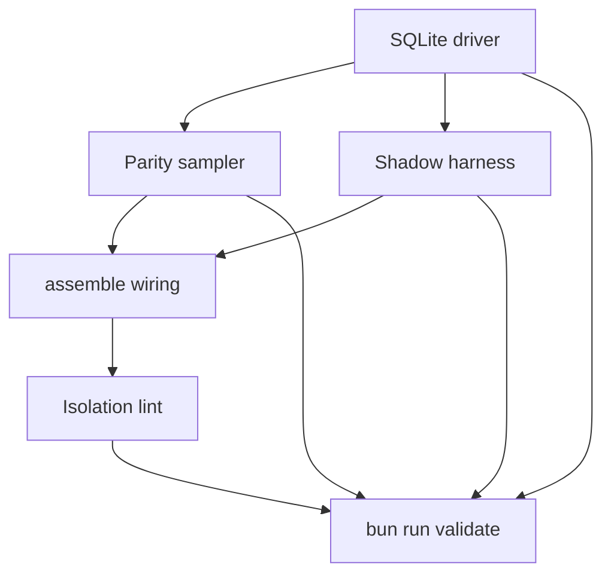

# q00019 — State Engine Phase 1

## Goal

Phase 1 de q00018. Entregar un segundo driver para el motor de
estado: `SqliteStateRegistry`, que cumple el mismo contrato
`StateRegistry` (Phase 0.1) pero persiste generaciones en SQLite
(WAL, short transactions, busy timeout corto), y un **parity
sampler** que corre en background comparando el driver SQLite con
un driver en memoria equivalente sobre la misma `IHydrateInput`.

> Phase 1 NO cambia comportamiento. Sigue construyendo estado
> dentro de `.cache/delendai/state/`. Sigue siendo puro respecto
> al proyecto. Ni un solo read Path-A todavía consume el driver
> SQLite — el shadow existe para **verificar** que el camino
> nuevo y el legacy (la propuesta actual basada en JSON + mutex)
> nunca divergen en condiciones normales.

## why

Phase 0 (commit `99d17f26`) y Phase 0.1 (commit `50717a0d`) dejaron
los contratos finales de `@delendai/state`. Ambas fases
mantuvieron deliberadamente el driver en memoria para fijar los
invariantes *sin* atarse a un motor persistente. Phase 1 es
donde ese motor llega, pero **sin** confiar todavía en él para
reads de producción: ese salto es Phase 2 de q00018.

El reviewer externo lo dijo así:

> After Phase 0.1, introduce the SQLite shadow driver (separate
> package `@delendai/state-sqlite`) behind the same
> `IStateRegistry` contract. The acceptance #1 property —
> `incremental ≡ cleanRebuild` over thousands of random
> sequences — runs against BOTH drivers, and a parity sampler
> reports any divergence.

Esa es exactamente la propuesta de este slice. Phase 0.1 ya pasa
los property tests contra el driver en memoria; Phase 1 los
añade contra el driver SQLite (WAL), y suma un sampler que
ejecuta los dos drivers en paralelo durante X ciclos.

## why this design

**Backend separado (`@delendai/state-sqlite`).** El paquete
`@delendai/state` se mantiene puro de TypeScript (la lint del
Phase 0.1 sigue cubriéndolo). `better-sqlite3` (o equivalente)
vive en `@delendai/state-sqlite`, que importa los contratos del
primero y aporta la implementación persistente. Esto permite
sustituir el driver sin recompilar a `core` y sin tocar los
plugins que ya consumen `ctx.state`.

**WAL + busy timeout corto.** `journal_mode = WAL`,
`synchronous = NORMAL`, `busy_timeout = 150ms`. Cada write es
una transacción corta: el engine nunca abre una transacción
para ejecutar tests o `await`s largos. Esta regla es la misma
que Phase 0.1 ya respeta en el driver en memoria (no `await`
dentro de `rebuild` / `reconcile`).

**Generaciones como filas, no ficheros.** Cada generación es una
fila en `state_generations(id, parent_id, fingerprint_hash,
canonical_hash, status, created_at, project_lease_token,
storage_repo_id, storage_worktree_id, holder_count)`. Las
projections viven en `state_projections(generation_id,
producer_id, projection_json)`. Las generaciones draining /
reaped se purgan por GC; la canonical projection se conserva en
el log de generaciones hasta que el GC reapa.

**Sin PRAGMA `journal_mode = WAL` cruzado entre procesos sin
atención.** Phase 1 deja las migrations / pragmas en un solo
fichero inicial; no se hace fan-out cross-process todavía. El
`sync` ocurre en arranque; no se hace `pragma_optimize`-style
mantenimiento.

**Parity sampler, no assertions duras todavía.** Una herramienta
`state_parity_report { since, scope? }` lee los últimos N
hashes canónicos del sampler y reporta diffs. Cuando el sampler
acumule N ciclos consecutivos sin diff, es señal de que la
Phase 2 puede sustituir reads.

**Sin redsyncronización entre swarm.sqlite y worktree.sqlite.**
Phase 1 introduce `state_project.sqlite` (per worktree) y
`state_swarm.sqlite` (compartido local). El primero se monta
bajo `<cacheDir>/state/v1/project.sqlite`; el segundo bajo
`<swarmRoot>/state/v1/swarm.sqlite` cuando el scope es `swarm`.
El driver elige el fichero según el kind del scope.

## non-goals

- NO cambia comportamiento observable para plugins
  productores.
- NO toca el `proposals/index.json` ni el reconciliador
  legacy. Sólo aporta el camino nuevo detrás de un flag.
- NO hace writes a Git, Markdown, ni configuración durable
  desde el engine.
- NO sincroniza SQLite entre máquinas.
- NO sustituye ningún read path de Phase 0/0.1 en plugins
  todavía. Eso es Phase 2 de q00018.
- NO introduce migraciones multi-versión (Phase 1 acepta sólo
  Estado con `STATE_ABI_VERSION == 1`).
- NO persiste todavía contenido de inputs (sólo metadata).
  Eso es Phase 3+.

## architecture

```
                  PROJECT SOURCES (read-only)
                         │
                         ▼
                  IStateInputSnapshot
                         │
        ┌────────────────┴─────────────────────┐
        │                                      │
        ▼                                      ▼
   InMemoryStateRegistry            SqliteStateRegistry (new)
   (Phase 0.1 driver,                  │
   tests-only)                        ▼
        │                       state_project.sqlite   /   state_swarm.sqlite
        │                       (per worktree)        (per local swarm)
        │                                      │
        └──────────────┬────────────────────────┘
                       │
                       ▼
                  StateParitySampler
                       │
              ┌────────┴────────┐
              ▼                 ▼
        parity_report       parity_alert
       (last N hashes)    (any divergence)
```

El sampler vive en `tools/scripts/state/parity-sampler.script.ts`
y se ejecuta como job de CI con un TTL corto. Su único output es
un `parity-report.json` que el `state_health` plugin lee.

## slices

### S1 — `@delendai/state-sqlite` package + `SqliteStateRegistry`

- **Status**: pending
- **Files**: `packages/state-sqlite/{package.json,tsconfig.json,README.md,src/index.ts,src/lib/driver.ts,src/lib/schema.ts,src/lib/migrations.ts,tests/src/driver.spec.ts}`
- **Gate**: `typecheck` + `test`
- Implementa `StateRegistry` (Phase 0.1) sobre
  `better-sqlite3` con `journal_mode=WAL`, `busy_timeout=150ms`,
  synchronous=NORMAL.
- `state_generations` y `state_projections` como описан
  arriba. WAL checkpoint en cada `publish()` (best-effort).
- Tests espejo de `InMemoryStateRegistry` para garantizar que
  las 46 aserciones de Phase 0.1 pasan también aquí.

### S2 — `state_parity_sampler` background tool

- **Status**: pending
- **Files**: `tools/scripts/state/parity-sampler.script.ts`,
  `tools/scripts/lib/with-compute-lock.script.ts`
- **Gate**: `lint` + `test`
- Crea N scopes (project + swarm), corre K operaciones
  aleatorias en AMBOS drivers en paralelo, y compara
  `canonicalHash` por generación.
- En cada diff, log estructurado al sink del plugin `logs`.
- Resultado: `state-parity-report.json` con `{ runs, divergences
  }` + lista de generaciones divergentes.

### S3 — `@delendai/state` shadow harness

- **Status**: pending
- **Files**: `packages/state/tests/src/shadow/parity.spec.ts`
- **Gate**: `test`
- Property test que carga `@delendai/state-sqlite`
  condicionalmente (`env HAS_STATE_SQLITE=1`) y corre los
  property tests de Phase 0.1 (equivalence, determinism,
  corruption) contra el driver SQLite también.
- Si el driver SQLite no está disponible, el suite se salta
  con un mensaje claro.

### S4 — Wiring: `assemble.ts` registers the SQLite driver behind the same registry

- **Status**: pending
- **Files**: `packages/core/src/lib/cli/assemble.ts`
- **Gate**: `typecheck`
- `assemble.ts` intenta cargar `@delendai/state-sqlite`; si no
  está disponible, sigue con el driver en memoria. La
  elección es por capability, no por config.
- El `ctx.state` ahora es el wrapper union (`driver-tagged`,
  in-memory vs SQLite) para que `state_parity` reporte cuál
  usó cada test run.

### S5 — Lint del boundary del nuevo paquete

- **Status**: pending
- **Files**: `tools/scripts/lint/no-node-imports-in-state.script.ts`
- **Gate**: `lint`
- La nueva lint deja de buscar dentro de `packages/state-sqlite/`
  y permite Node-only modules ahí (la lint original sólo miraba
  `packages/state/` y `plugins/<name>/src/lib/state/`). La
  nueva `state-engine-isolation.lint.ts` afirma que el contrato
  surface sigue siendo pure-TS y que el SQLite driver vive
  exclusivamente bajo `state-sqlite/`.

## dependency graph



## acceptance

- [ ] `packages/state-sqlite/package.json` declara `better-sqlite3`
      como dep y exports el driver.
- [ ] `SqliteStateRegistry` cumple el contrato `StateRegistry` de
      Phase 0.1. Los 46 tests de Phase 0.1 pasan también contra
      SQLite.
- [ ] `state_parity_sampler` corre 1000 ops aleatorias sin
      divergencias en una instalación limpia.
- [ ] CI ejecuta el sampler nightly y sube el `parity-report.json`.
- [ ] La lint isolations sigue green: `packages/state/src` es
      pure-TS; `packages/state-sqlite/src` permite Node.
- [ ] `bun run validate` verde.
- [ ] Conventional Commit (`feat(state-sqlite): …`) firmado y
      pusheado.

## risks and mitigations

- **Riesgo**: la latencia del SQLite driver sobre paths comunes
  introduce regresiones de performance en CI.
  **Mitigación**: el sampler mide latencias P50/P95 por ciclo
  y aborta con `WARN` cuando P95 > 50ms en el host del CI.
- **Riesgo**: WAL + concurrencia + busy_timeout insuficiente
  produce `SQLITE_BUSY` durante PRs concurrentes.
  **Mitigación**: retry interno de una sola capa (3 retries,
  10ms / 30ms / 100ms backoff) con log estructurado. Tests
  incluyen un test de concurrencia con N workers.
- **Riesgo**: la lint del nuevo paquete se olvida.
  **Mitigación**: el suite `lint:state-engine-isolation` corre
  en CI; un test `tests/src/shadow/isolation.spec.ts` ejecuta
  la lint como test.

## notes

- `q00018` (ready) — sigue siendo la fuente de Phase 0–6; este
  plan cubre Phase 1.
- `x00501` (ready → merged) — Phase 0.1 ya está mergeada; este
  plan se apoya en sus contracts.
- `x00428` (in-progress) — el camino canónico de worktrees.
  Phase 5 de q00018 lo consumirá; este plan no lo necesita
  todavía.
- `c00012` (done) — la lint + el sampler mantienen el invariant
  "el swarm no entra en pánico si un host se reinicia".
- Phase 1 verde → Phase 2: proposal reads vía SQLite
  (shadow-first); sustituir `proposals/index.json` cuando el
  sampler lleve N ciclos sin diff. Phase 3-6: igual que q00018.
