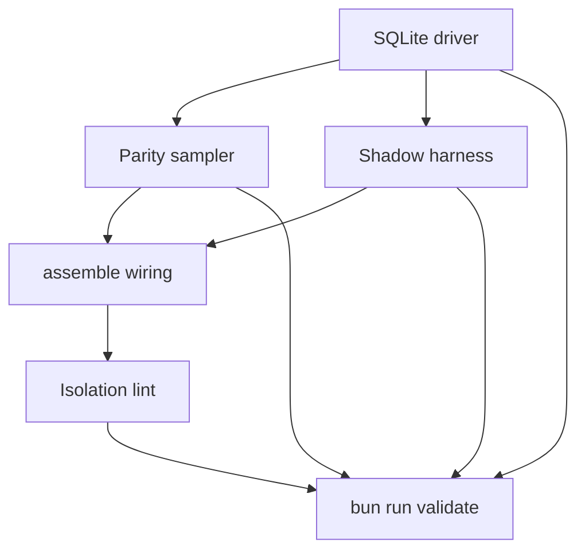

# q00019 — State Engine Phase 1

## Goal

Phase 1 de q00018. Entregar un segundo driver para el motor de
estado: `SqliteStateRegistry`, que cumple el mismo contrato
`StateRegistry` (Phase 0.2) pero persiste generaciones en SQLite
(WAL, short transactions, busy timeout corto), y un **parity
sampler** que corre en background comparando el driver SQLite con
un driver en memoria equivalente sobre la misma `IHydrateInput`.

> Phase 1 NO cambia comportamiento. Sigue construyendo estado
> dentro de `.cache/delendai/state/`. Sigue siendo puro respecto
> al proyecto. Ni un solo read Path-A todavía consume el driver
> SQLite — el shadow existe para **verificar** que el camino
> nuevo y el legacy (la propuesta actual basada en JSON + mutex)
> nunca divergen en condiciones normales.
>
> **Facade model.** Phase 1 introduces a `IStateRegistryFacade`
> that owns TWO drivers behind the SAME `IStateRegistry`
> contract: the **primary** (in-memory, always the source of
> truth for production reads) and the **shadow** (SQLite, run in
> lockstep but never read by plugins). The shadow exists to
> catch regressions in the persistence layer before Phase 2
> promotes it to primary. Phase 1 NEVER installs SQLite as the
> default; the default is always the in-memory driver. SQLite is
> only constructed when the host explicitly opts in via
> `delendai.config.json#state.parity.shadow.enabled = true`.

## why

Phase 0 (commit `99d17f26`) y Phase 0.1 (commit `50717a0d`) dejaron
los contratos finales de `@delendai/state`. Ambas fases
mantuvieron deliberadamente el driver en memoria para fijar los
invariantes *sin* atarse a un motor persistente. Phase 1 es
donde ese motor llega, pero **sin** confiar todavía en él para
reads de producción: ese salto es Phase 2 de q00018.

El reviewer externo lo dijo así:

> After Phase 0.1, introduce the SQLite shadow driver (separate
> package `@delendai/state-sqlite`) behind the same
> `IStateRegistry` contract. The acceptance #1 property —
> `incremental ≡ cleanRebuild` over thousands of random
> sequences — runs against BOTH drivers, and a parity sampler
> reports any divergence.

Esa es exactamente la propuesta de este slice. Phase 0.1 ya pasa
los property tests contra el driver en memoria; Phase 1 los
añade contra el driver SQLite (WAL), y suma un sampler que
ejecuta los dos drivers en paralelo durante X ciclos.

## why this design

**Backend separado (`@delendai/state-sqlite`).** El paquete
`@delendai/state` se mantiene puro de TypeScript (la lint del
Phase 0.2 sigue cubriéndolo). `better-sqlite3` (o equivalente)
vive en `@delendai/state-sqlite`, que importa los contratos del
primero y aporta la implementación persistente. Esto permite
sustituir el driver sin recompilar a `core` y sin tocar los
plugins que ya consumen `ctx.state`.

**Facade, no primary.** Phase 1 introduces
`@delendai/state-facade` which holds the **primary** driver
(always in-memory for now) and the **shadow** driver (SQLite,
only if opted in). All `ctx.state.*` calls go through the
facade; the facade routes them to the primary, and (if
enabled) replays them against the shadow for parity. Phase 2
may swap primary → shadow once the sampler proves parity for N
cycles.

**WAL + busy timeout corto.** `journal_mode = WAL`,
`synchronous = NORMAL`, `busy_timeout = 150ms`. Cada write es
una transacción corta: el engine nunca abre una transacción
para ejecutar tests o `await`s largos. Esta regla es la misma
que Phase 0.1 ya respeta en el driver en memoria (no `await`
dentro de `rebuild` / `reconcile`).

**No WAL checkpoint per publish.** Phase 1 deliberately does
NOT call `PRAGMA wal_checkpoint(...)` after every `publish`.
The cost is linear in WAL frames; doing it per publish turns
every write into an `fsync` storm. Instead, the driver runs
`wal_checkpoint(PASSIVE)` at most once per N publishes (default
N=64) AND once per process shutdown. PASSIVE never blocks
readers; TRUNCATE/FULL are reserved for explicit operator
actions via `state_sqlite_checkpoint { mode: 'TRUNCATE' }`.

**Generaciones como filas, no ficheros.** El schema completo:

```
state_generations(
  id TEXT PRIMARY KEY,
  parent_id TEXT,
  scope_key TEXT NOT NULL,         -- canonical scopeStateKey(scope)
  fingerprint_json_canonical TEXT, -- Phase 0.2: stable JSON of ICanonicalProjectFingerprint
  canonical_hash TEXT,             -- sha256 of the projection merge
  status TEXT,                     -- 'active' | 'draining' | 'reaped'
  created_at INTEGER,
  project_lease_token INTEGER,
  storage_repo_id TEXT,
  storage_worktree_id TEXT,
  holder_count INTEGER,
  _holder_count_source TEXT        -- 'derived' | NULL
);
state_projections(
  generation_id TEXT NOT NULL REFERENCES state_generations(id),
  producer_id TEXT NOT NULL,
  projection_json TEXT NOT NULL,   -- canonical serialisation of IProjectionResult.canonical
  PRIMARY KEY (generation_id, producer_id)
);
state_project_leases(
  lease_id TEXT PRIMARY KEY,       -- Phase 0.2 (x00502 S4): 'pNNNNNN'
                                    -- six-digit zero-padded serial from
                                    -- InMemoryStateRegistry.nextProjectLeaseSerial.
                                    -- Pre-Phase-0.2 drafts used the
                                    -- 'project:project:gNNNNNN-NNNN:N'
                                    -- encoded form — that format
                                    -- collided with swarm-claim ids
                                    -- because both projects and swarm
                                    -- shared the `project:` segment.
                                    -- Phase 0.2 leases are uniquely
                                    -- identified by `leaseId` alone.
  scope_key TEXT NOT NULL,
  generation_id TEXT NOT NULL,
  token INTEGER NOT NULL,
  acquired_at INTEGER,
  released_at INTEGER              -- NULL while held
);
state_swarm_claims(
  slot TEXT PRIMARY KEY,
  scope_key TEXT NOT NULL,
  token INTEGER NOT NULL,
  generation_id TEXT NOT NULL,
  holder_id TEXT NOT NULL,
  acquired_at INTEGER,
  released_at INTEGER              -- NULL while held
);
state_fencing_tokens(
  scope_key TEXT,
  next_project_lease_token INTEGER,
  next_swarm_lease_token INTEGER,
  next_generation_serial INTEGER,
  PRIMARY KEY (scope_key)
);
state_holders(
  holder_id TEXT PRIMARY KEY,
  generation_id TEXT NOT NULL,
  acquired_at INTEGER
);
```

`state_generations.fingerprint_json_canonical` stores the
STABLE JSON form (producer order canonicalised, input order
canonicalised) so the SQLite shadow can verify it later
without re-running producers. Without this column the shadow
would have to recompute the fingerprint from inputs at lookup
time, which makes the parity comparison unreliable when the
host and shadow see slightly different inputs (e.g. due to a
bug in `validateSnapshot`).

Las generaciones draining / reaped se purgan por GC; la
canonical projection se conserva en `state_projections` hasta
que el GC reapa (FK ON DELETE CASCADE).

**Sin PRAGMA `journal_mode = WAL` cruzado entre procesos sin
atención.** Phase 1 deja las migrations / pragmas en un solo
fichero inicial; no se hace fan-out cross-process todavía. El
`sync` ocurre en arranque; no se hace `pragma_optimize`-style
mantenimiento.

**Driver parity vs replay/execution determinism.** The
sampler reports two distinct kinds of divergence:

  - **Driver parity** — `state_generations.canonical_hash`
    between in-memory and SQLite shadow for the same
    `(scope, generation_id)`. This catches bugs in the
    SQLite driver's serialisation, validation, or fencing
    logic.

  - **Replay/execution determinism** — between two fresh
    in-memory registries replaying the SAME op sequence.
    This is what Phase 0.1's property tests already check;
    the sampler adds noise / scheduling fuzz so regressions
    surface under real concurrency. The earlier
    "domain parity" wording was ambiguous (it could mean
    in-memory-vs-SQLite OR registry-vs-registry) so we
    renamed it to make the comparison explicit: replay is
    "did both registries see the same input sequence?",
    execution is "did both produce the same fingerprint
    for that sequence?". The two halves are checked
    independently.

Driver parity is the SUCCESS criterion for promoting the SQLite
driver. Replay/execution determinism is a regression net that
already passes on Phase 0.2; the sampler merely re-runs it
under load.

**Parity sampler, no assertions duras todavía.** Una herramienta
`state_parity_report { since, scope? }` lee los últimos N
hashes canónicos del sampler y reporta diffs (separated by
driver-vs-domain). Cuando el sampler acumule N ciclos
consecutivos sin driver diff, es señal de que la Phase 2 puede
sustituir reads.

**Sin redsyncronización entre swarm.sqlite y worktree.sqlite.**
Phase 1 introduce `state_project.sqlite` (per worktree) y
`state_swarm.sqlite` (compartido local). El primero se monta
bajo `<cacheDir>/state/v1/project.sqlite`; el segundo bajo
`<swarmRoot>/state/v1/swarm.sqlite` cuando el scope es `swarm`.
El driver elige el fichero según el kind del scope.

## non-goals

- NO cambia comportamiento observable para plugins
  productores.
- NO toca el `proposals/index.json` ni el reconciliador
  legacy. Sólo aporta el camino nuevo detrás de un flag.
- NO hace writes a Git, Markdown, ni configuración durable
  desde el engine.
- NO sincroniza SQLite entre máquinas.
- NO sustituye ningún read path de Phase 0/0.1 en plugins
  todavía. Eso es Phase 2 de q00018.
- NO introduce migraciones multi-versión (Phase 1 acepta sólo
  Estado con `STATE_ABI_VERSION == 1`).
- NO persiste todavía contenido de inputs (sólo metadata).
  Eso es Phase 3+.

## architecture

```
                  PROJECT SOURCES (read-only)
                         │
                         ▼
                  IStateInputSnapshot
                         │
        ┌────────────────┴─────────────────────┐
        │                                      │
        ▼                                      ▼
   InMemoryStateRegistry            SqliteStateRegistry (new)
   (Phase 0.1 driver,                  │
   tests-only)                        ▼
        │                       state_project.sqlite   /   state_swarm.sqlite
        │                       (per worktree)        (per local swarm)
        │                                      │
        └──────────────┬────────────────────────┘
                       │
                       ▼
                  StateParitySampler
                       │
              ┌────────┴────────┐
              ▼                 ▼
        parity_report       parity_alert
       (last N hashes)    (any divergence)
```

El sampler vive en `tools/scripts/state/parity-sampler.script.ts`
y se ejecuta como job de CI con un TTL corto. Su único output es
un `parity-report.json` que el `state_health` plugin lee.

## slices

### S1 — `@delendai/state-sqlite` package + `SqliteStateRegistry`

- **Status**: pending
- **Files**: `packages/state-sqlite/{package.json,tsconfig.json,README.md,src/index.ts,src/lib/driver.ts,src/lib/schema.ts,src/lib/migrations.ts,tests/src/driver.spec.ts}`
- **Gate**: `typecheck` + `test`
- Implementa `StateRegistry` (Phase 0.2) sobre
  `better-sqlite3` con `journal_mode=WAL`, `busy_timeout=150ms`,
  synchronous=NORMAL.
- Schema completo (ver §why this design): `state_generations`
  con `fingerprint_json_canonical`, `state_projections`,
  `state_project_leases`, `state_swarm_claims`,
  `state_fencing_tokens`, `state_holders`.
- WAL checkpoint con backpressure: máximo 1 cada 64 publishes
  (configurable), `mode=PASSIVE`, más 1 TRUNCATE en process
  shutdown vía `state_sqlite_checkpoint { mode: 'TRUNCATE' }`.
- Tests espejo de `InMemoryStateRegistry` para garantizar que
  las 55 aserciones de Phase 0.2 pasan también aquí (incluidos
  los 9 nuevos tests de Phase 0.2).

### S2 — `state_parity_sampler` background tool

- **Status**: pending
- **Files**: `tools/scripts/state/parity-sampler.script.ts`,
  `tools/scripts/lib/with-compute-lock.script.ts`
- **Gate**: `lint` + `test`
- Crea N scopes (project + swarm), corre K operaciones
  aleatorias en AMBOS drivers en paralelo, y compara
  `canonicalHash` por generación.
- En cada diff, log estructurado al sink del plugin `logs`.
- Resultado: `state-parity-report.json` con `{ runs, divergences
  }` + lista de generaciones divergentes.

### S3 — `@delendai/state` shadow harness

- **Status**: pending
- **Files**: `packages/state/tests/src/shadow/parity.spec.ts`
- **Gate**: `test`
- Property test que carga `@delendai/state-sqlite`
  condicionalmente (`env HAS_STATE_SQLITE=1`) y corre los
  property tests de Phase 0.1 (equivalence, determinism,
  corruption) contra el driver SQLite también.
- Si el driver SQLite no está disponible, el suite se salta
  con un mensaje claro.

### S4 — `@delendai/state-facade` + assemble wiring

- **Status**: pending
- **Files**: `packages/state-facade/{package.json,tsconfig.json,src/index.ts,src/lib/facade.ts}`, `packages/core/src/lib/cli/assemble.ts`, `delendai.config.json#state.parity.shadow`
- **Gate**: `typecheck` + `test`
- `delendai.config.json#state.parity.shadow.enabled = false` (default).
- `assemble.ts` consulta el flag: si está en `false`,
  construye SOLO el driver en memoria y lo envuelve en la
  facade (que entonces no tiene shadow). Si está en `true`,
  intenta cargar `@delendai/state-sqlite`; si no está
  disponible, falla con un mensaje claro (no degrada a
  in-memory para el shadow, porque entonces el sampler no
  tiene nada que muestrear).
- La facade expone la MISMA superficie `IStateRegistry`. Las
  llamadas a `hydrate` / `incremental` / `lookup` ejecutan en
  primary y, si shadow está presente, replican en shadow;
  `validateSnapshot` corre en ambos lados; el resultado de
  cada call devuelve la respuesta del primary.

### S5 — Lint del boundary del nuevo paquete

- **Status**: pending
- **Files**: `tools/scripts/lint/no-node-imports-in-state.script.ts`
- **Gate**: `lint`
- La nueva lint deja de buscar dentro de `packages/state-sqlite/`
  y permite Node-only modules ahí (la lint original sólo miraba
  `packages/state/` y `plugins/<name>/src/lib/state/`). La
  nueva `state-engine-isolation.lint.ts` afirma que el contrato
  surface sigue siendo pure-TS y que el SQLite driver vive
  exclusivamente bajo `state-sqlite/`.

## dependency graph



## acceptance

- [ ] `packages/state-sqlite/package.json` declara `better-sqlite3`
      como dep y exports el driver.
- [ ] `packages/state-facade/package.json` exporta
      `IStateRegistryFacade` con primary + (optional) shadow.
- [ ] `delendai.config.json#state.parity.shadow.enabled` default
      es `false`; cuando es `false`, ningún código intenta
      cargar `@delendai/state-sqlite`.
- [ ] `SqliteStateRegistry` cumple el contrato `IStateRegistry` de
      Phase 0.2 + Phase 0.3 (x00504 S2-S5: digest_mismatch
      invariant, sha256BytesHex raw bytes, driver-neutral
      fingerprint, scope-local snapshot). Los 63 tests
      correspondientes pasan también contra SQLite.
      SQLite.
- [ ] El schema incluye las 6 tablas (state_generations con
      `fingerprint_json_canonical`, state_projections,
      state_project_leases, state_swarm_claims,
      state_fencing_tokens, state_holders).
- [ ] WAL checkpoint es PASSIVE y limitado a 1 cada 64 publishes;
      TRUNCATE sólo se ejecuta en shutdown vía herramienta
      explícita.
- [ ] `state_parity_sampler` corre 1000 ops aleatorias sin
      divergencias en una instalación limpia, y separa driver
      parity de replay/execution determinism.
- [ ] CI ejecuta el sampler nightly y sube el `parity-report.json`
      con `driverParityDivergences` y
      `replayDeterminismDivergences` +
      `executionDeterminismDivergences` como campos distintos.
- [ ] La lint isolations sigue green: `packages/state/src` es
      pure-TS; `packages/state-sqlite/src` permite Node.
- [ ] `bun run validate` verde.
- [ ] Conventional Commit (`feat(state-facade+state-sqlite): …`)
      firmado y pusheado.

## risks and mitigations

- **Riesgo**: la latencia del SQLite driver sobre paths comunes
  introduce regresiones de performance en CI.
  **Mitigación**: el sampler mide latencias P50/P95 por ciclo
  y aborta con `WARN` cuando P95 > 50ms en el host del CI.
- **Riesgo**: WAL + concurrencia + busy_timeout insuficiente
  produce `SQLITE_BUSY` durante PRs concurrentes.
  **Mitigación**: retry interno de una sola capa (3 retries,
  10ms / 30ms / 100ms backoff) con log estructurado. Tests
  incluyen un test de concurrencia con N workers.
- **Riesgo**: la lint del nuevo paquete se olvida.
  **Mitigación**: el suite `lint:state-engine-isolation` corre
  en CI; un test `tests/src/shadow/isolation.spec.ts` ejecuta
  la lint como test.

## notes

- `q00018` (ready) — sigue siendo la fuente de Phase 0–6; este
  plan cubre Phase 1.
- `x00501` (ready → merged) — Phase 0.1 ya está mergeada; este
  plan se apoya en sus contracts.
- `x00428` (in-progress) — el camino canónico de worktrees.
  Phase 5 de q00018 lo consumirá; este plan no lo necesita
  todavía.
- `c00012` (done) — la lint + el sampler mantienen el invariant
  "el swarm no entra en pánico si un host se reinicia".
- Phase 1 verde → Phase 2: proposal reads vía SQLite
  (shadow-first); sustituir `proposals/index.json` cuando el
  sampler lleve N ciclos sin diff. Phase 3-6: igual que q00018.
