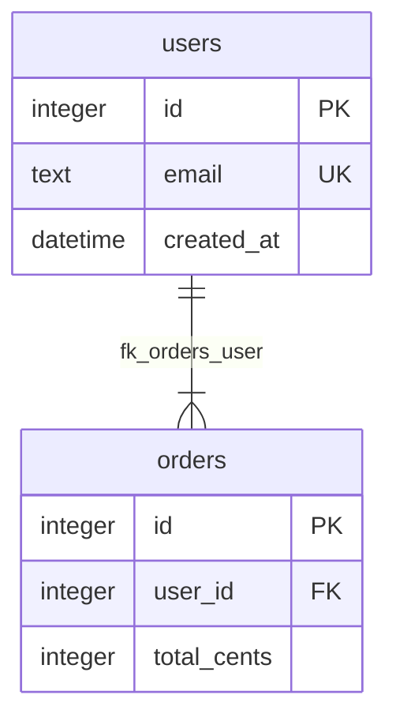

# `@delendai/database`

Driver-agnostic database introspection + query tools for mcp-vertex.

## Slice status (proposal f00128)

| Slice | Status | Description |
|-------|--------|-------------|
| S1    | **done** | Schema introspection (`db_schema`, `db_probe`). Pure read. |
| S2    | **done** | Query guard + EXPLAIN (`db_query`, `db_explain`). |
| S3    | **done** | ERD rendering + catalog knowledge (`db_erd`). |

## Public surface

```ts
import {
	buildSchema,
	createSqliteDriver,
	buildDatabaseSchemaToolRegistrations,
	type IDatabaseDriver,
} from '@delendai/database/public';
```

Hosts can mount the same tools the plugin mounts (`db_schema`,
`db_probe`, `db_query`, `db_explain`, `db_erd`) without depending on
the plugin's private structure.

## ERD tool

`db_erd` introspects the current schema and returns a deterministic
mermaid `erDiagram` string plus entity/relationship counts. Pass an
optional `tables` array to focus the output on a subset of tables.

Example request:

```json
{
  "tables": ["users", "orders"]
}
```

Example response excerpt:



That mermaid block can be pasted directly into a docs page or wiki. It
also pairs with the `diagram` plugin: both tools emit mermaid that the
docs site can render without extra conversion.

## Optional peer dependency

`better-sqlite3` is an optional peer dependency. The SQLite driver
returns a typed `install-required` envelope when the package is not
present, so the plugin never throws at boot time. Hosts that only need
the introspection engine against a fake driver (tests, dry-runs)
require no install.

```bash
bun add better-sqlite3
```

## License

MIT